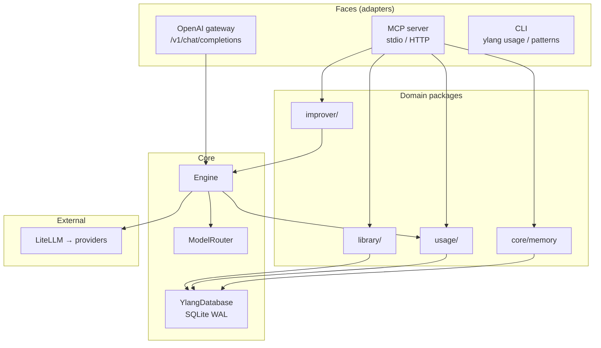
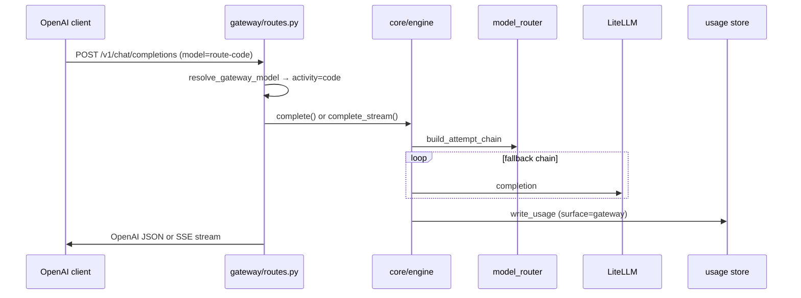
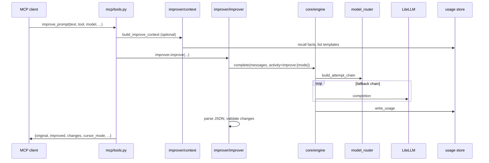

# Architecture

Ylang follows a **single core engine, multiple thin faces** design. Business logic lives in `src/ylang/core` and domain packages; adapters (MCP and OpenAI gateway) only translate I/O.

## High-level diagram



## Design principles

1. **One engine** — `Engine.complete()` and `Engine.complete_stream()` are the only paths for LLM calls. Faces never call LiteLLM directly.
2. **Propose-only improver** — `improve_prompt` returns suggestions; it does not auto-apply edits to files or commands.
3. **Local-first** — SQLite at a configurable path; no Ylang cloud storage.
4. **Usage from day one** — Every completion writes a row to the `usage` table.
5. **Thin adapters** — MCP, gateway, and CLI subcommands serialize I/O; they do not embed routing or provider logic.

## Package layout

```
src/ylang/
├── __main__.py          # Entry: MCP server, ylang usage, ylang patterns
├── settings.py          # Typed config from environment
├── cli/
│   ├── usage.py         # Aggregates and standalone HTML dashboard export
│   └── patterns.py      # ylang patterns suggest (learned templates)
├── core/
│   ├── engine.py        # LiteLLM completion + usage logging (stream + tools)
│   ├── model_router.py  # Activity-based model selection, fallback chain
│   ├── db.py            # Shared SQLite connection (WAL, busy timeout)
│   ├── stores.py        # open_stores() — one connection, three stores
│   ├── memory.py        # Scoped facts (remember / recall)
│   └── types.py         # Activity, Message, CompletionResult
├── improver/
│   ├── improver.py      # Propose-only prompt improvement
│   ├── context.py       # Conversation, facts, reference prompts
│   ├── reference.py     # Reference-only prompt pass-through (no LLM)
│   ├── registry.py      # Cursor mode resolution, auto-apply defaults
│   └── types.py         # ImprovementResult, Change
├── library/
│   ├── store.py         # Versioned template CRUD (in-memory list cache)
│   ├── retrieval.py     # Score/select reference prompts
│   ├── pattern_detector.py  # Usage-based pattern detection
│   ├── patterns.py      # Pattern detector registry
│   ├── seeds.py         # Built-in seed templates
│   └── types.py         # Template, TemplateParam, visibility
├── usage/
│   ├── store.py         # Usage row writes and time-window reads
│   ├── activity.py      # Canonical activity labels at write time
│   ├── aggregates.py    # Summaries by activity, model, cost (TTL cache)
│   ├── dashboard.py     # Chart.js HTML for GET /usage and CLI export
│   └── async_ops.py     # run_store_sync for non-blocking HTTP handlers
├── gateway/
│   ├── routes.py        # /v1/chat/completions, /v1/models, GET /usage
│   ├── mapping.py       # Virtual route-* model resolution
│   └── openai.py        # Request parsing and response shaping
├── importer/            # CSV public-prompt import (CLI + MCP tool)
└── mcp/
    ├── server.py        # FastMCP wiring and transport
    ├── tools.py         # MCP tool handlers (thin serializers)
    ├── deps.py          # YlangDeps dependency bundle
    └── auth.py          # Bearer token middleware (HTTP only)
```

## Request flow: gateway chat completion



## Request flow: improve_prompt



## Model routing

`ModelRouter` builds an **attempt chain** per request:

1. Start from activity's model list (or explicit `model` parameter).
2. Skip models whose provider key is missing.
3. Skip providers in cooldown after retryable errors.
4. Apply optional daily budget cap from usage aggregates.
5. Optionally reorder by personal usage success rates.
6. Append `fallback_model` (default `ollama/qwen2.5`) at the end.

See `src/ylang/core/model_router.py` for implementation details.

## Storage model

All persistent data shares **one SQLite connection** opened by `open_stores()`:

| Store | Module | Tables |
|-------|--------|--------|
| Usage | `usage/store.py` | `usage` |
| Library | `library/store.py` | `templates`, `template_versions` |
| Memory | `core/memory.py` | `facts` |

WAL mode and a 5s busy timeout are enabled on open. See [database-schema.md](database-schema.md).

## Cursor mode resolution

The improver resolves one of five Cursor modes before building the LLM prompt:

| Mode | Typical use |
|------|-------------|
| `agent` | Implementation tasks (default) |
| `plan` | Architecture / design only |
| `debug` | Bug investigation |
| `ask` | Explanations and questions |
| `multitask` | Parallel workstreams |

Resolution order: explicit `mode` parameter → tool name aliases → prompt keyword inference → default `agent`.

Mode affects improver guidance (e.g. plan mode avoids implementation deliverables). See `src/ylang/improver/registry.py`.

## Transports

| Transport | Use case | Auth |
|-----------|----------|------|
| `stdio` | Cursor subprocess MCP | None |
| `http` | Shared remote instance, MCP + gateway, Cursor hooks | Bearer `YLANG_AUTH_TOKEN` |

HTTP uses FastMCP's streamable HTTP app with gateway routes registered on the same app, wrapped with `BearerTokenMiddleware`.

On HTTP startup, `run_server()` creates **two** `Engine` instances sharing one usage store:

| Engine | `surface` | Used by |
|--------|-----------|---------|
| MCP engine | `mcp` | `improve_prompt` and other MCP tools |
| Gateway engine | `gateway` | `/v1/chat/completions` (only when `YLANG_TRANSPORT=http`) |

Usage rows distinguish faces via the `surface` column.

### Async SQLite access

The usage store uses synchronous `sqlite3` with `check_same_thread=False` so worker threads can safely run queries. HTTP gateway handlers run blocking store and engine calls via `anyio.to_thread.run_sync` (`usage/async_ops.py`) so concurrent requests do not block the event loop.

### Concurrent gateway profiling

Lightweight load testing: `python scripts/gateway_load_test.py --concurrency 8 --requests 40` (mocked Engine) or `--live http://127.0.0.1:8787 TOKEN` for live `/v1/models` probes.

Findings at current scale (single process, ~40 concurrent mocked completions):

- Thread offload via `anyio.to_thread.run_sync` is **sufficient** — p95 latency stays low and error rate is 0 under mocked load.
- SQLite WAL + short-lived connections per request avoid lock contention in tests.
- Full **aiosqlite** migration is deferred unless profiling on a multi-client production instance shows thread-pool saturation or WAL busy timeouts.

See [gateway.md](gateway.md) for virtual models and Cursor setup.

## v0.2.0 faces (HTTP transport)

| Face | Path / command | Notes |
|------|----------------|-------|
| MCP | `/mcp` or stdio | 11 tools including `improve_prompt` |
| Gateway | `POST /v1/chat/completions`, `GET /v1/models` | Streaming tool-call passthrough; token counts in final SSE chunk |
| Usage dashboard | `GET /usage` | Chart.js, 30s auto-refresh |
| CLI | `ylang usage`, `ylang patterns suggest` / `apply` | Standalone HTML export via `ylang usage dashboard`; digest via `ylang usage digest` |

`Library.list_templates()` caches summaries in memory until the next `save()`.

Optional Ollama smoke tests use `@pytest.mark.llm_e2e`.

## Extension points

| Seam | Location | Status |
|------|----------|--------|
| OpenAI gateway | `gateway/` | **Live** on HTTP transport |
| Usage dashboard | `usage/dashboard.py`, `GET /usage` | **Live** on HTTP transport |
| Pattern detector | `library/patterns.py` | **Live** (`UsagePatternDetector`) |
| Personal preference routing | `model_router.apply_preference_order` | Implemented, uses usage aggregates |
| Learned templates | `library/store.py` `source="learned"` | MCP tools + `ylang patterns suggest` / `apply`; auto-injected in improver context |

## Related docs

- [Configuration](configuration.md) — env vars, model prioritization, routing tuning
- [Gateway](gateway.md) — OpenAI-compatible routing for Cursor
- [MCP tools reference](mcp-tools.md)
- [Database schema](database-schema.md)
- [Dead code audit](dead-code.md)
