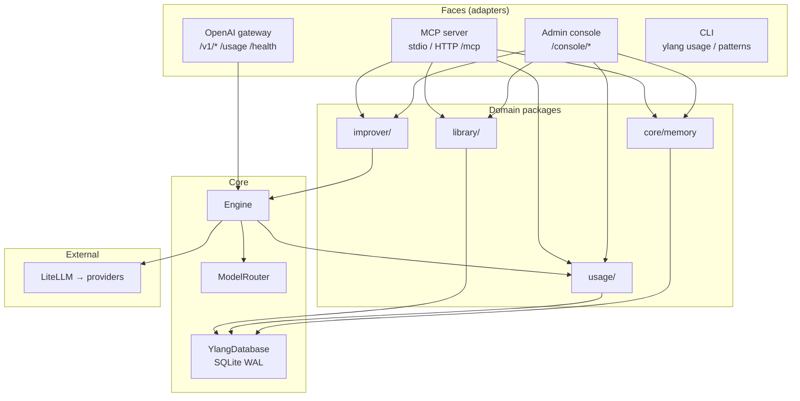
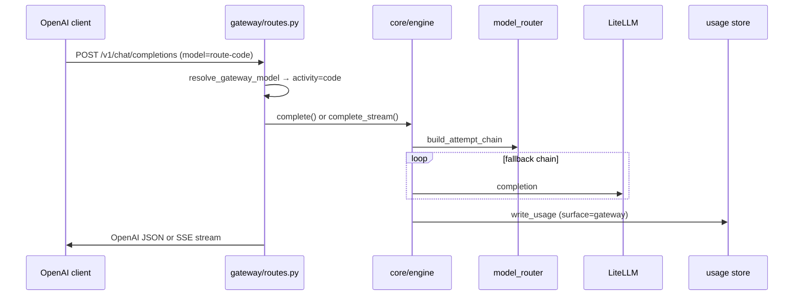
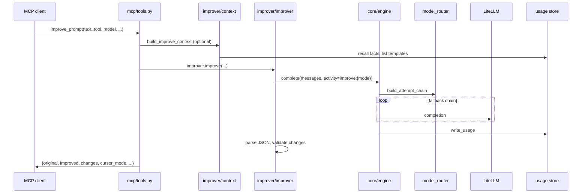

# Architecture

Ylang follows a **single core engine, multiple thin faces** design. Business logic lives in `src/ylang/core` and domain packages; face adapters only translate I/O.

**Three live faces** share one core when running on HTTP transport (`YLANG_TRANSPORT=http`):

1. **MCP server** — stdio (local Cursor subprocess) or HTTP (`/mcp`); improver, templates, facts, usage analytics, pattern tools.
2. **OpenAI-compatible gateway** — on the same HTTP process: `POST /v1/chat/completions`, `GET /v1/models`, `GET /usage`, `GET /health`. Virtual models `route-code`, `route-search`, `route-reason`, and `route-other` map to activity-based routing; other model strings passthrough to named providers.
3. **Admin console (Portal)** — `/console/*` (session cookie or Bearer); Operator Hub (`/console/control`) includes the **Optimize Ylang** wizard; Parameters, Templates, Feedback, and governed proposals. See [portal.md](portal.md).

Stdio transport runs MCP only (no `/v1/*` or `/console/*` routes). See [gateway.md](gateway.md) for Cursor custom-endpoint setup.

**Edit feedback dual gate:** console runtime `edit_feedback` gates Feedback nav/UI; Cursor hook capture requires `YLANG_CAPTURE_EDIT_FEEDBACK=1` (alias `YLANG_EDIT_FEEDBACK`; `sessionStart` defaults to `1`). Both must be on for polish-ratio samples.

## High-level diagram


```mermaid
flowchart TB
    subgraph faces["Faces (adapters)"]
        MCP["MCP server<br/>stdio / HTTP /mcp"]
        GW["OpenAI gateway<br/>/v1/* /usage /health"]
        CON["Admin console<br/>/console/*"]
        CLI["CLI<br/>ylang usage / patterns"]
    end

    subgraph domain["Domain packages"]
        IMP["improver/"]
        LIB["library/"]
        USG["usage/"]
        MEM["core/memory"]
    end

    subgraph core["Core"]
        ENG["Engine"]
        RTR["ModelRouter"]
        DB["YlangDatabase<br/>SQLite WAL"]
    end

    subgraph external["External"]
        LLM["LiteLLM → providers"]
    end

    MCP --> IMP
    MCP --> LIB
    MCP --> USG
    MCP --> MEM
    CON --> IMP
    CON --> LIB
    CON --> USG
    CON --> MEM
    GW --> ENG
    IMP --> ENG
    ENG --> RTR
    ENG --> USG
    ENG --> LLM
    LIB --> DB
    USG --> DB
    MEM --> DB
```

## Design principles

1. **One engine** — `Engine.complete()` and `Engine.complete_stream()` are the only paths for LLM calls. Faces never call LiteLLM directly.
2. **Propose-only improver** — `improve_prompt` returns suggestions; it does not auto-apply edits to files or commands.
3. **Local-first** — SQLite at a configurable path; no Ylang cloud storage.
4. **Usage from day one** — Every completion writes a row to the `usage` table.
5. **Thin adapters** — MCP, gateway, admin console, and CLI subcommands serialize I/O; they do not embed routing or provider logic.

## Package layout

```
src/ylang/
├── __main__.py          # Entry: MCP server, ylang usage, ylang patterns
├── settings.py          # Typed config from environment
├── cli/
│   ├── usage.py         # Aggregates and standalone HTML dashboard export
│   └── patterns.py      # ylang patterns suggest (learned templates)
├── core/
│   ├── engine.py        # LiteLLM completion + usage logging (stream + tools)
│   ├── model_router.py  # Semantic activity → concrete LiteLLM route
│   ├── model_aliases.py # Compatibility aliases (builtin / overlay / prefix)
│   ├── config_parsers.py # Shared parse_model_list / parse_bool_flag
│   ├── sqlite_rows.py   # SqliteRow + cell_* converters for typed rows
│   ├── runtime_settings.py  # SQLite overrides + merge_settings
│   ├── db.py            # Shared SQLite connection (WAL, busy timeout)
│   ├── stores.py        # open_stores() — one connection, three stores
│   ├── memory.py        # Scoped facts (remember / recall)
│   ├── routing_reason.py # Explainable routing_reason_json payloads
│   └── types.py         # Activity, ModelResolution, CompletionResult
├── improver/
│   ├── improver.py      # Improver class + cache / orchestration
│   ├── parse.py         # LLM JSON/prose payload parsing
│   ├── validate.py      # Safety validation (anchors, numbers, replay)
│   ├── salvage.py       # Salvage / short-prompt fallback paths
│   ├── context.py       # Conversation, facts, reference prompts
│   ├── reference.py     # Reference-only prompt pass-through (no LLM)
│   ├── registry.py      # Cursor mode resolution, auto-apply defaults
│   └── types.py         # ImprovementResult, Change
├── library/
│   ├── store.py         # Versioned template CRUD (in-memory list cache)
│   ├── retrieval.py     # Score/select reference prompts
│   ├── pattern_detector.py  # Usage-based pattern detection
│   ├── patterns.py      # Pattern detector registry
│   ├── seeds.py         # Built-in seed templates
│   └── types.py         # Template, TemplateParam, visibility
├── usage/
│   ├── store.py         # Usage row writes and time-window reads
│   ├── activity.py      # Canonical activity labels at write time
│   ├── aggregates.py    # Summaries by activity, model, cost (TTL cache)
│   ├── dashboard.py     # Chart.js HTML for GET /usage and CLI export
│   ├── optimizer.py     # Optimization suggestions by family
│   └── async_ops.py     # run_store_sync for non-blocking HTTP handlers
├── console/
│   ├── routes.py        # register_console_routes orchestrator
│   ├── context.py       # ConsoleContext shared by route modules
│   ├── route_modules/   # Domain HTTP handlers (templates, facts, ops, …)
│   ├── pages.py         # Re-exports screen renderers
│   ├── page_modules/    # Per-screen HTML builders
│   ├── layout.py        # Shared chrome / nav
│   └── static/          # Chart.js + extracted page CSS/JS
├── gateway/
│   ├── routes.py        # /v1/chat/completions, /v1/models, /usage, /health
│   ├── mapping.py       # Virtual route-* model resolution
│   └── openai.py        # Request parsing and response shaping
├── importer/            # CSV public-prompt import (CLI + MCP tool)
├── telemetry/           # Optional OTLP export (disabled by default)
└── mcp/
    ├── server.py        # FastMCP wiring and transport
    ├── tools.py         # register_tools orchestrator
    ├── tool_groups/     # Domain MCP tool registrars
    ├── serializers.py   # Tool response/request serializers
    ├── deps.py          # YlangDeps dependency bundle
    └── auth.py          # Bearer token middleware (HTTP only)
```

## Request flow: gateway chat completion


```mermaid
sequenceDiagram
    participant Client as OpenAI client
    participant GW as gateway/routes.py
    participant Eng as core/engine
    participant Rtr as model_router
    participant LLM as LiteLLM
    participant DB as usage store

    Client->>GW: POST /v1/chat/completions (model=route-code)
    GW->>GW: resolve_gateway_model → activity=code
    GW->>Eng: complete() or complete_stream()
    Eng->>Rtr: build_attempt_chain
    loop fallback chain
        Eng->>LLM: completion
    end
    Eng->>DB: write_usage (surface=gateway)
    GW->>Client: OpenAI JSON or SSE stream
```

## Request flow: improve_prompt


```mermaid
sequenceDiagram
    participant Client as MCP client
    participant Tools as mcp/tools.py
    participant Ctx as improver/context
    participant Imp as improver/improver
    participant Eng as core/engine
    participant Rtr as model_router
    participant LLM as LiteLLM
    participant DB as usage store

    Client->>Tools: improve_prompt(text, tool, model, ...)
    Tools->>Ctx: build_improve_context (optional)
    Ctx->>DB: recall facts, list templates
    Tools->>Imp: improver.improve(...)
    Imp->>Eng: complete(messages, activity=improve:{mode})
    Eng->>Rtr: build_attempt_chain
    loop fallback chain
        Eng->>LLM: completion
    end
    Eng->>DB: write_usage
    Imp->>Imp: parse JSON, validate changes
    Tools->>Client: {original, improved, changes, cursor_mode, ...}
```

## Model routing

`ModelRouter` selects a **concrete LiteLLM route** behind a **stable semantic
activity** (`code`, `search`, `reason`, `improve`, `other`). Vendor model names
are the current tested policy defaults, not a permanently-latest frontier.

Attempt chain per request:

1. Start from activity's model list (or explicit `model` parameter).
2. For **`improve:*`**, Cursor slugs (`claude-sonnet-4-*`, `composer`, `auto`, …)
   defer to `models_improve` — only LiteLLM `provider/model` strings prepend.
3. Skip models whose provider key is missing.
4. Skip providers in cooldown after retryable errors.
5. Apply optional daily budget cap from usage aggregates.
6. Optionally reorder by personal usage success rates (**skipped for `improve`**
   so configured `models_improve` order stays authoritative).
7. Append `fallback_model` (default `ollama/qwen2.5`) at the end.

`ModelRouter.resolve()` returns a `ModelResolution` (requested alias, semantic
route, provider/model, machine-readable `resolution_reason`). Engine persists
that on `routing_reason_json`. Aliases are compatibility mappings, not identity.

`ModelRouter.select_model()` uses `select_from_quality_band()`: unknown/`0.0`
LiteLLM cost is never treated as free. Runtime `models_*` edits vs the
construction-time baseline set `resolution_reason=operator_override`.

`Engine.complete` / `complete_stream` **hot-reload** runtime SQLite overrides
(`RuntimeSettingsStore`) into the router when the engine was built via
`Engine.from_settings`. Improver context retrieval also hard-blocks templates
with 0% accept rate and ≥3 injections (see `library/effectiveness.py`).

Optional OTLP export (`ylang/telemetry/`) is disabled by default, never
replaces the local usage store, and uses **batched async** export
(`BatchSpanProcessor`) so a slow collector cannot stall completions.
Content export stays off unless `YLANG_OTEL_EXPORT_CONTENT` is set and
capture level is `redacted` or `full_local`. Install `pip install 'ylang[otel]'`.

See `src/ylang/core/model_router.py` and [models.md](models.md).

## Storage model

All persistent data shares **one SQLite connection** opened by `open_stores()`:

| Store | Module | Tables |
|-------|--------|--------|
| Usage | `usage/store.py` | `usage` |
| Library | `library/store.py` | `templates`, `template_versions` |
| Memory | `core/memory.py` | `facts` |

WAL mode and a 5s busy timeout are enabled on open. See [database-schema.md](database-schema.md).

## Cursor mode resolution

The improver resolves one of five Cursor modes before building the LLM prompt:

| Mode | Typical use |
|------|-------------|
| `agent` | Implementation tasks (default) |
| `plan` | Architecture / design only |
| `debug` | Bug investigation |
| `ask` | Explanations and questions |
| `multitask` | Parallel workstreams |

Resolution order: explicit `mode` parameter → tool name aliases → prompt keyword inference → default `agent`.

Mode affects improver guidance (e.g. plan mode avoids implementation deliverables). See `src/ylang/improver/registry.py`.

## Transports

| Transport | Use case | Auth |
|-----------|----------|------|
| `stdio` | Cursor subprocess MCP | None |
| `http` | Shared remote instance, MCP + gateway, Cursor hooks | Bearer `YLANG_AUTH_TOKEN` on `/mcp`, `/v1/*`, and `/usage`; `GET /health` is unauthenticated |

HTTP uses FastMCP's streamable HTTP app with gateway routes registered on the same app, wrapped with `BearerTokenMiddleware`.

On HTTP startup, `run_server()` creates **two** `Engine` instances sharing one usage store:

| Engine | `surface` | Used by |
|--------|-----------|---------|
| MCP engine | `mcp` | `improve_prompt` and other MCP tools |
| Gateway engine | `gateway` | `/v1/chat/completions` (only when `YLANG_TRANSPORT=http`) |

Usage rows distinguish faces via the `surface` column.

### Async SQLite access

The usage store uses synchronous `sqlite3` with `check_same_thread=False` so worker threads can safely run queries. HTTP gateway handlers run blocking store and engine calls via `anyio.to_thread.run_sync` (`usage/async_ops.py`) so concurrent requests do not block the event loop.

### Concurrent gateway profiling

Lightweight load testing: `python scripts/gateway_load_test.py --concurrency 8 --requests 40` (mocked Engine) or `--live http://127.0.0.1:8787 TOKEN` for live `/v1/models` probes.

Findings at current scale (single process, ~40 concurrent mocked completions):

- Thread offload via `anyio.to_thread.run_sync` is **sufficient** — p95 latency stays low and error rate is 0 under mocked load.
- SQLite WAL + short-lived connections per request avoid lock contention in tests.
- Full **aiosqlite** migration is deferred unless profiling on a multi-client production instance shows thread-pool saturation or WAL busy timeouts.

See [gateway.md](gateway.md) for virtual models and Cursor setup.

## HTTP faces (gateway routes)

| Route | Method | Auth | Notes |
|-------|--------|------|-------|
| `/v1/chat/completions` | `POST` | Bearer | Activity routing via virtual `route-*` models; streaming SSE + tool passthrough |
| `/v1/models` | `GET` | Bearer | Catalog of four virtual `route-*` models |
| `/usage` | `GET` | Bearer | Chart.js dashboard; 30s auto-refresh |
| `/health` | `GET` | None | Version JSON for probes |

`Library.list_templates()` caches summaries in memory until the next `save()`.

Optional Ollama smoke tests use `@pytest.mark.llm_e2e`.

## Admin console (HTTP) — third face

When `YLANG_TRANSPORT=http`, the same process serves `/console/*` (session cookie or Bearer). This is the **third face** alongside MCP and the OpenAI gateway — same core stores and engine, browser UX for operators. See [portal.md](portal.md).

Operator Hub (`/console/control`) includes the **Optimize Ylang** wizard (`#optimize-wizard`: diagnose → propose → apply → measure) plus KPIs and top applyable proposals.

### Intended navigation IA

Target information architecture (document even if the live nav is still a flat list):

| Group | Pages | Notes |
|-------|-------|-------|
| **Core** | Control, Overview, Usage, Improver, Templates, Facts, Patterns, Proposals | Always visible; Operator Hub is the ops home |
| **Learn** | Experiments, Feedback | **Gated** — appear in nav only when runtime flags `experiments` / `edit_feedback` are on |
| **System** | Data, Advisor, Setup, Parameters, Ops | Advanced or primary per IA; Health linked from Setup |

Templates support `visibility=archived` (excluded from improver retrieval) and toxic quarantine (`toxic=1` / `archive-toxic`). Data manager adds search + safe mutators (cache clear, usage scrub). Parameters exposes Fast/cheap vs Quality presets, preferred-template chips, and a pending-proposals embed.

Settings and Ops document usage digests as **CLI/cron only** (optional Linux `notify-send` when a display is available) — the console does not email or push digests.

Edit-distance Feedback requires the **dual gate** (console `edit_feedback` + hook `YLANG_CAPTURE_EDIT_FEEDBACK`).

## Status

### Shipped

- MCP server (stdio and HTTP `/mcp`) — 17 tools including improver, library, facts, usage, pattern and analytics tools
- OpenAI-compatible gateway on HTTP transport — all four routes above; virtual models `route-code`, `route-search`, `route-reason`, `route-other`
- Admin console on HTTP (third face) — Operator Hub + Optimize wizard, templates, facts, analytics, proposals, Parameters, ops
- Bearer auth on `/mcp`, `/v1/*`, `/console/*`, and `/usage` when `YLANG_AUTH_TOKEN` is set; `/health` exempt
- Activity-based model routing, fallback chain, provider cooldown, usage-based preference boost
- **Daily budget cap enforced at runtime** — when `YLANG_DAILY_BUDGET_USD` is set and rolling 24h spend ≥ cap, `ModelRouter.apply_budget_filter` drops cloud models from candidate lists (local `ollama/*` remains via fallback); 80% startup stderr warning
- Usage logging on every LLM call; `GET /usage` dashboard and CLI export
- Pattern detection (`detect_patterns`, `ylang patterns suggest` / `apply`) and learned-template improver context
- Propose-only improver and optimization surfaces (`optimization_suggestions`, optional `YLANG_EXPERIMENTS=1`)
- Local usage digest CLI with optional desktop notify (`notify-send`)

### Planned

- **Auto-evaluation loop** — experiments and optimization suggestions are surfaced propose-only; no automatic closure (routing/template updates from outcomes without manual review)
- **Pattern-learning maturity** — detection and manual apply exist; fuller automation not yet shipped
- **Grouped/gated console nav** — intended IA above; live build may still list all links flat
- **Email digest** — desktop notify is local-only

Not in scope: optimizer with provenance, GitHub/KB sources, hosted team features.

## Related docs

- [Configuration](configuration.md) — env vars, model prioritization, routing tuning
- [Gateway](gateway.md) — OpenAI-compatible routing for Cursor
- [MCP tools reference](mcp-tools.md)
- [Database schema](database-schema.md)
- [Dead code audit](dead-code.md)
