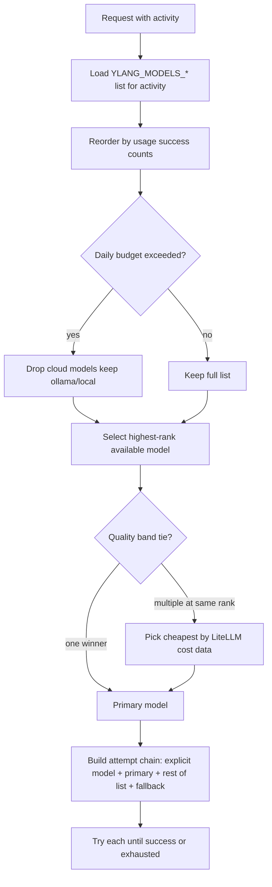

# Configuration

Ylang loads configuration from **environment variables** at startup via `Settings.load()` in `src/ylang/settings.py`. Copy [.env.example](../.env.example) as a starting point.

For production systemd deployments, use an environment file (e.g. `/srv/ylang/ylang.env`) referenced by `EnvironmentFile=` in the unit — see [deployment.md](deployment.md).

## Quick reference — all variables

| Variable | Default | Section |
|----------|---------|---------|
| `YLANG_STORAGE_PATH` | `~/.ylang/ylang.db` | [Storage](#storage) |
| `YLANG_TRANSPORT` | `stdio` | [MCP transport](#mcp-transport) |
| `YLANG_HOST` | `0.0.0.0` | [MCP transport](#mcp-transport) |
| `YLANG_PORT` | `8787` | [MCP transport](#mcp-transport) |
| `YLANG_AUTH_TOKEN` | *(none)* | [MCP transport](#mcp-transport) |
| `OPENAI_API_KEY` | *(none)* | [Provider API keys](#llm-provider-api-keys) |
| `ANTHROPIC_API_KEY` | *(none)* | [Provider API keys](#llm-provider-api-keys) |
| `MISTRAL_API_KEY` | *(none)* | [Provider API keys](#llm-provider-api-keys) |
| `PERPLEXITY_API_KEY` | *(none)* | [Provider API keys](#llm-provider-api-keys) |
| `YLANG_MODELS_CODE` | see [defaults](#default-model-lists) | [Model prioritization](#model-prioritization) |
| `YLANG_MODELS_SEARCH` | see [defaults](#default-model-lists) | [Model prioritization](#model-prioritization) |
| `YLANG_MODELS_REASON` | see [defaults](#default-model-lists) | [Model prioritization](#model-prioritization) |
| `YLANG_MODELS_IMPROVE` | see [defaults](#default-model-lists) | [Model prioritization](#model-prioritization) |
| `YLANG_MODELS_OTHER` | see [defaults](#default-model-lists) | [Model prioritization](#model-prioritization) |
| `YLANG_FALLBACK_MODEL` | `ollama/qwen2.5` | [Fallback and resilience](#fallback-and-resilience) |
| `YLANG_QUALITY_BAND` | `0` | [Quality band and cost tie-break](#quality-band-and-cost-tie-break) |
| `YLANG_PROVIDER_COOLDOWN_SECONDS` | `60` | [Fallback and resilience](#fallback-and-resilience) |
| `YLANG_DAILY_BUDGET_USD` | *(none)* | [Daily budget cap](#daily-budget-cap) |
| `YLANG_HOOK_DISABLED` | *(unset)* | [Cursor hook overrides](#cursor-hook-overrides) |
| `YLANG_HOOK_MODEL` | `claude-sonnet-4-5` | [Cursor hook overrides](#cursor-hook-overrides) |
| `YLANG_MCP_URL` | from `~/.cursor/mcp.json` | [Cursor hook overrides](#cursor-hook-overrides) |

Deprecated (single-model): `YLANG_MODEL_CODE`, `YLANG_MODEL_SEARCH`, `YLANG_MODEL_REASON`, `YLANG_MODEL_OTHER` — use the `YLANG_MODELS_*` list form instead.

---

## Storage

| Variable | Default | Description |
|----------|---------|-------------|
| `YLANG_STORAGE_PATH` | `~/.ylang/ylang.db` | Path to the SQLite database file |

All templates, usage rows, and facts are stored in this single file. Ylang does not upload data to any Ylang-operated cloud service.

---

## MCP transport

| Variable | Default | Description |
|----------|---------|-------------|
| `YLANG_TRANSPORT` | `stdio` | `stdio` (subprocess) or `http` (streamable HTTP) |
| `YLANG_HOST` | `0.0.0.0` | Bind address when transport is `http` |
| `YLANG_PORT` | `8787` | Bind port when transport is `http` |
| `YLANG_AUTH_TOKEN` | *(none)* | **Required** for `http` transport. Bearer token for MCP clients |

### stdio (default)

Used by Cursor and other MCP clients that spawn a subprocess:

```json
{
  "mcpServers": {
    "ylang": {
      "command": "python",
      "args": ["-m", "ylang"],
      "env": {
        "ANTHROPIC_API_KEY": "sk-..."
      }
    }
  }
}
```

### HTTP (remote / shared instance)

```bash
export YLANG_TRANSPORT=http
export YLANG_PORT=8787
export YLANG_AUTH_TOKEN="$(openssl rand -hex 32)"
export YLANG_STORAGE_PATH=/srv/ylang/data/ylang.db
python -m ylang
```

Client config:

```json
{
  "mcpServers": {
    "ylang": {
      "url": "http://127.0.0.1:8787/mcp",
      "headers": {
        "Authorization": "Bearer YOUR_TOKEN"
      }
    }
  }
}
```

When transport is `http`, the same process also serves the OpenAI gateway at `/v1/*` (see [gateway.md](gateway.md)). Stdio transport has **no** gateway routes.

---

## LLM provider API keys

Ylang routes LLM calls through [LiteLLM](https://github.com/BerriAI/litellm). **Cloud models are silently skipped** when their provider API key is missing — they are not errors, just unavailable candidates.

| Variable | Provider | LiteLLM prefix | Example models |
|----------|----------|----------------|----------------|
| `OPENAI_API_KEY` | OpenAI | `openai/` | `openai/gpt-4o`, `openai/o3-mini`, `openai/gpt-4o-mini` |
| `ANTHROPIC_API_KEY` | Anthropic | `anthropic/` | `anthropic/claude-3-5-sonnet-latest`, `anthropic/claude-sonnet-4-6` |
| `MISTRAL_API_KEY` | Mistral | `mistral/` or `mistralai/` | `mistral/mistral-large-latest`, `mistral/mistral-small-latest` |
| `PERPLEXITY_API_KEY` | Perplexity | `perplexity/` | `perplexity/sonar` |

### Adding a provider

1. Set the provider's `*_API_KEY` in your env file or MCP `env` block.
2. Restart Ylang (`sudo systemctl restart ylang` or restart the MCP subprocess).
3. Models for that provider in the [default lists](#default-model-lists) become **available** automatically — no code changes required.

You do **not** need to edit `YLANG_MODELS_*` unless you want to change **order** or **which** models are tried.

### Models without API keys

| Prefix | Key required? | Notes |
|--------|---------------|-------|
| `ollama/` | No | Local inference; see [Local Ollama](#local-ollama-fallback) |
| Other LiteLLM-supported prefixes | Varies | Use LiteLLM docs for provider-specific env vars |

### Startup diagnostics

On boot, stderr reports:

```
llm providers configured:
  openai, anthropic, mistral
llm providers not configured:
  perplexity
```

Followed by the [routing report](#reading-the-routing-report) for each activity.

---

## Model prioritization

Ylang picks models in **quality-first** order: try the best model you configured, fall through on failure, end on the local fallback floor.

### Activities

Every LLM call is tagged with an **activity** that selects a candidate list:

| Activity | Used for | Default list env var |
|----------|----------|---------------------|
| `code` | Implementation-style work, debug mode improver | `YLANG_MODELS_CODE` |
| `search` | Search / retrieval | `YLANG_MODELS_SEARCH` |
| `reason` | Reasoning, ask/plan mode improver | `YLANG_MODELS_REASON` |
| `improve` | Prompt improvement (default improver path) | `YLANG_MODELS_IMPROVE` |
| `other` | Unclassified calls | `YLANG_MODELS_OTHER` |

#### Improver mode → activity mapping

`improve_prompt` logs activity as `improve:<cursor_mode>`. The router maps modes to list buckets:

| Cursor mode | Routes to activity list |
|-------------|-------------------------|
| `agent`, `debug`, `multitask` | `code` (`YLANG_MODELS_CODE`) |
| `ask`, `plan` | `reason` (`YLANG_MODELS_REASON`) |
| *(improve bucket directly)* | `improve` (`YLANG_MODELS_IMPROVE`) — when activity is exactly `improve` |

So tuning `YLANG_MODELS_CODE` affects agent/debug/multitask improvements; tuning `YLANG_MODELS_REASON` affects ask/plan improvements.

### Default model lists

When no `YLANG_MODELS_*` override is set:

| Activity | Default order (index 0 = highest priority) |
|----------|---------------------------------------------|
| `code` | `anthropic/claude-3-5-sonnet-latest` → `openai/o3-mini` → `openai/gpt-4o` → `mistral/mistral-large-latest` |
| `search` | `perplexity/sonar` → `openai/gpt-4o` → `anthropic/claude-3-5-sonnet-latest` |
| `reason` | `openai/o3-mini` → `anthropic/claude-3-5-sonnet-latest` → `openai/gpt-4o` |
| `improve` | `anthropic/claude-3-5-sonnet-latest` → `openai/gpt-4o` → `mistral/mistral-small-latest` |
| `other` | `mistral/mistral-small-latest` → `openai/gpt-4o-mini` → `anthropic/claude-3-5-sonnet-latest` |

**Leftmost model in the list = highest priority.** Only models whose provider key is set (or that don't need a key) are actually attempted.

### Overriding priority — `YLANG_MODELS_*`

Set a comma-separated LiteLLM model string per activity. **Order matters** — first entry is tried first (subject to availability, budget, and cooldown rules below).

```bash
# Prefer OpenAI for code, Anthropic as backup
YLANG_MODELS_CODE=openai/gpt-4o,anthropic/claude-3-5-sonnet-latest,mistral/mistral-large-latest

# Cheaper model first for low-stakes "other" work
YLANG_MODELS_OTHER=openai/gpt-4o-mini,mistral/mistral-small-latest

# Single provider only (only works if that key is set)
YLANG_MODELS_IMPROVE=mistral/mistral-large-latest
```

Rules:

- At least one model per list (empty list is an error).
- Duplicates are removed; first occurrence wins.
- Use `provider/model` format (LiteLLM convention).
- Restart required after env changes.

### How selection works (step by step)



1. **Candidate list** — from `YLANG_MODELS_<ACTIVITY>` (or defaults).
2. **Personal preference** — models with more successful calls in the last 24h move earlier (see [Usage-based reorder](#usage-based-reorder)).
3. **Budget filter** — if `YLANG_DAILY_BUDGET_USD` is exceeded, cloud models are removed; local `ollama/` models remain.
4. **Primary selection** — highest-rank model that is available (key present, not in cooldown).
5. **Cost tie-break** — among models within `YLANG_QUALITY_BAND` ranks of the best, pick the cheapest.
6. **Attempt chain** — on failure (rate limit, 5xx, model not found), try the next available model in the list, then `YLANG_FALLBACK_MODEL`.

### Per-request explicit model

MCP `improve_prompt` accepts a `model` argument. When set:

- Known **Cursor slugs** (e.g. `claude-sonnet-4-5`) map to LiteLLM strings via [aliases](#cursor-model-slug-aliases).
- Known **LiteLLM strings** (e.g. `openai/gpt-4o`) are tried **first** in the chain.
- Unknown slugs are logged and ignored; activity routing takes over.

This does **not** replace your `YLANG_MODELS_*` lists — it prepends one override for that single call.

### Reading the routing report

After restart, stderr shows effective routing (example):

```
quality_band: 0
activity routing (quality order → selected):
  code:
    [0] anthropic/claude-3-5-sonnet-latest  available  ← selected
    [1] openai/o3-mini  available
    [2] openai/gpt-4o  available
    [3] mistral/mistral-large-latest  skipped:no_key
  ...
fallback floor: ollama/qwen2.5  available
```

| Status | Meaning |
|--------|---------|
| `available` | Key present, not in cooldown — may be selected |
| `skipped:no_key` | Provider API key not set — skipped |
| `skipped:cooldown` | Provider failed recently — temporarily skipped |

---

## Quality band and cost tie-break

| Variable | Default | Description |
|----------|---------|-------------|
| `YLANG_QUALITY_BAND` | `0` | Max rank distance from the best available model when breaking ties by cost |

When multiple models are **available** at similar priority ranks, Ylang picks the **cheapest** (by LiteLLM `input_cost_per_token + output_cost_per_token`) among models within the quality band of the best rank.

| Value | Behavior |
|-------|----------|
| `0` | Only models at the **exact** best rank compete on cost; strict quality-first |
| `1` | Best model and the next rank can compete on cost |
| `2` | Top three ranks can compete on cost — more cost-saving, less strict quality |

Example: if ranks 0 and 1 are both available and `YLANG_QUALITY_BAND=1`, Ylang may pick rank-1 if it is significantly cheaper.

---

## Fallback and resilience

| Variable | Default | Description |
|----------|---------|-------------|
| `YLANG_FALLBACK_MODEL` | `ollama/qwen2.5` | Last-resort model appended to every attempt chain |
| `YLANG_PROVIDER_COOLDOWN_SECONDS` | `60` | Seconds to skip a **provider** after retryable failure (429, 5xx) |

### Fallback model

Always appended at the end of the attempt chain if not already present. Use for:

- Local Ollama when cloud is down
- A cheap cloud model as ultimate backup: `YLANG_FALLBACK_MODEL=openai/gpt-4o-mini`

### Provider cooldown

When a cloud provider returns a retryable error, **all models from that provider** are skipped for the cooldown period. Cooldown is in-memory (resets on process restart).

---

## Daily budget cap

| Variable | Default | Description |
|----------|---------|-------------|
| `YLANG_DAILY_BUDGET_USD` | *(none)* | Rolling 24h spend cap in USD |

When total logged `cost` in the last 24 hours ≥ cap:

- **Cloud models** (any provider requiring an API key) are removed from candidate lists.
- **Local models** (`ollama/`, no provider key) remain available.

Unset = no budget limit. Spending is computed from the local `usage` table.

```bash
YLANG_DAILY_BUDGET_USD=5.00
```

---

## Usage-based reorder

Ylang reads your local usage history (last 24h) and **boosts models with higher success counts** earlier in the candidate list — without changing your configured `YLANG_MODELS_*` order permanently.

This is automatic when a usage store is wired (always true for the MCP server). No env var to toggle. Effect is subtle: a model you use successfully often may jump ahead of a higher-ranked model that you rarely use.

---

## Usage activity normalization

Every usage row is normalized at write time via `normalize_usage_activity()` in `usage/activity.py`:

| Raw activity | Stored as |
|--------------|-----------|
| `improve:Cursor`, `improve:cursor-agent` | `improve:agent` |
| `improve:plan-mode`, `improve:planning` | `improve:plan` |
| `improve:debug-mode`, `improve:troubleshoot` | `improve:debug` |
| `improve:ask-mode`, `improve:question` | `improve:ask` |
| `code`, `CODE` | `code` |
| Unknown `improve:*` suffix | `improve:<lowercased-slug>` |

The improver logs `improve:{cursor_mode}` (e.g. `improve:agent`), not the MCP `tool` parameter. Aggregates in `usage_summary` group by these stored labels.

---

## Cursor model slug aliases

When `improve_prompt` (or hooks) pass a Cursor IDE slug as `model`, the router maps it to LiteLLM:

| Cursor slug | LiteLLM model |
|-------------|---------------|
| `claude-sonnet-4-5`, `claude-sonnet-4-6`, `composer`, `composer-2.5-fast` | `anthropic/claude-sonnet-4-6` |
| `claude-4.6-sonnet-high-thinking`, `claude-4.6-sonnet-medium-thinking` | `anthropic/claude-sonnet-4-6` |
| `claude-4.6-opus-high-thinking` | `anthropic/claude-opus-4-6` |
| `gpt-5.3-codex-high-fast`, `gpt-5.5-medium`, `gemini-3.1-pro` | `openai/gpt-4o` |
| `claude-sonnet-4-*` (prefix) | `anthropic/claude-sonnet-4-6` |
| `claude-opus-4-*` (prefix) | `anthropic/claude-opus-4-6` |

Unknown slugs fall back to activity routing. Full table: `src/ylang/core/model_router.py`.

---

## Cursor hook overrides

| Variable | Default | Description |
|----------|---------|-------------|
| `YLANG_HOOK_DISABLED` | *(unset)* | Set to `1` to skip auto prompt improvement |
| `YLANG_HOOK_MODEL` | `claude-sonnet-4-5` | Model slug passed to `improve_prompt` from hooks |
| `YLANG_MCP_URL` | from `~/.cursor/mcp.json` | Override MCP HTTP URL for hooks |
| `YLANG_AUTH_TOKEN` | from mcp.json / env | Bearer token for hook MCP calls |

See [cursor-integration.md](cursor-integration.md).

---

## Local Ollama fallback

1. Install and run [Ollama](https://ollama.com).
2. Pull a model: `ollama pull qwen2.5`
3. Optionally set: `YLANG_FALLBACK_MODEL=ollama/qwen2.5` (this is already the default).

LiteLLM uses `http://localhost:11434` unless you set (in the same env file):

| Variable | Description |
|----------|-------------|
| `OLLAMA_API_BASE` | LiteLLM Ollama base URL (e.g. `http://localhost:11434`) |
| `OLLAMA_HOST` | Alternative host hint some LiteLLM versions honor |

These are **LiteLLM** variables, not read by `Settings.load()` — but they work when set in `ylang.env` or the MCP process environment.

---

## Configuration recipes

### Enable all cloud providers

```bash
OPENAI_API_KEY=...
ANTHROPIC_API_KEY=...
MISTRAL_API_KEY=...
PERPLEXITY_API_KEY=...
```

Default lists automatically use every provider you enable.

### Prefer one provider for prompt improvement

```bash
YLANG_MODELS_IMPROVE=anthropic/claude-3-5-sonnet-latest,openai/gpt-4o
# or
YLANG_MODELS_IMPROVE=mistral/mistral-large-latest,anthropic/claude-3-5-sonnet-latest
```

### Cost-conscious setup

```bash
YLANG_QUALITY_BAND=2
YLANG_DAILY_BUDGET_USD=3.00
YLANG_MODELS_OTHER=openai/gpt-4o-mini,mistral/mistral-small-latest
YLANG_FALLBACK_MODEL=ollama/qwen2.5
```

### Local-only (no cloud keys)

```bash
YLANG_MODELS_CODE=ollama/qwen2.5
YLANG_MODELS_IMPROVE=ollama/qwen2.5
YLANG_MODELS_OTHER=ollama/qwen2.5
YLANG_FALLBACK_MODEL=ollama/qwen2.5
```

### Production systemd env file layout

```bash
# /srv/ylang/ylang.env
YLANG_TRANSPORT=http
YLANG_HOST=0.0.0.0
YLANG_PORT=8787
YLANG_STORAGE_PATH=/srv/ylang/data/ylang.db
YLANG_AUTH_TOKEN=<openssl rand -hex 32>

OPENAI_API_KEY=...
ANTHROPIC_API_KEY=...
MISTRAL_API_KEY=...

# Optional tuning
YLANG_MODELS_IMPROVE=anthropic/claude-3-5-sonnet-latest,openai/gpt-4o,mistral/mistral-large-latest
YLANG_DAILY_BUDGET_USD=10.00
YLANG_QUALITY_BAND=1
YLANG_FALLBACK_MODEL=ollama/qwen2.5
OLLAMA_HOST=http://localhost:11434
```

Restart: `sudo systemctl restart ylang`

---

## Programmatic access

```python
from ylang.settings import Settings
from ylang.core.model_router import ModelRouter

settings = Settings.load()
router = ModelRouter.from_settings(settings)
print(settings.resolved_storage_path())
print(router.format_routing_report())
```

See [architecture.md](architecture.md) for how settings flow into `Engine` and `ModelRouter`.

---

## Related docs

- [deployment.md](deployment.md) — systemd and `ylang.env`
- [mcp-tools.md](mcp-tools.md) — `improve_prompt` `model` parameter
- [architecture.md](architecture.md) — routing internals
