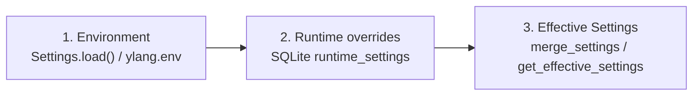
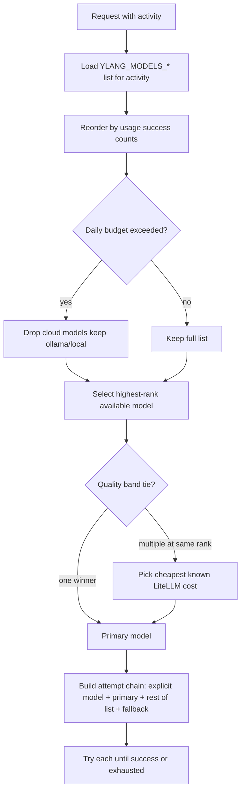

# Configuration

This is the **complete operator reference** for how Ylang is configured: env
files, process environment, SQLite runtime overrides (Portal **Parameters**),
provider keys, routing, privacy, hooks, and optional telemetry.

Canonical loaders:

| Piece | Code |
|-------|------|
| Typed settings | `Settings.load()` in `src/ylang/settings.py` |
| Env-file discovery | `src/ylang/core/env_file.py` |
| Runtime merge | `merge_settings()` / `get_effective_settings()` in `src/ylang/core/runtime_settings.py` |
| Activity lists | `DEFAULT_ACTIVITY_MODEL_LISTS` + `YLANG_MODELS_*` |
| Aliases | `src/ylang/core/model_aliases.py` |

Starting points:

- Template: [`.env.example`](https://github.com/Yann-0/ylang/blob/main/.env.example)
- Production systemd: `/srv/ylang/ylang.env` via `EnvironmentFile=` — [deployment.md](deployment.md)
- Live edits without restart: Portal **Parameters** (`/console/settings`) — [portal.md](portal.md)

---

## How configuration is loaded

```text
process environment (already set)
        ↓
first readable env file (does not override existing keys)
        ↓
Settings.load()  →  typed Settings (env baseline)
        ↓
runtime_settings SQLite  →  merge_settings()  →  effective Settings
        ↓
Engine / ModelRouter / Portal / MCP tools
```

### Env-file discovery

`Settings.load()` calls `load_discovered_env_file()`. The **first readable**
file wins. Keys already present in the process environment are **not**
overwritten (`override=False`).

Search order (`env_file_candidates()`):

1. `YLANG_ENV_FILE` if set (explicit path)
2. `/srv/ylang/ylang.env` (systemd host layout)
3. `<package-parent>/ylang.env` (repo wrapper `/srv/ylang/ylang.env` when the
   package lives in `app/`)
4. `~/.config/ylang/ylang.env`

Syntax: `KEY=VALUE` or `export KEY=VALUE`. `#` comments. Optional single or
double quotes around values.

**Systemd** still injects `EnvironmentFile=/srv/ylang/ylang.env` into the
process **before** Python starts, so those keys are already in `os.environ`
and the discovery loader is a no-op for them. Discovery matters for CLI
(`ylang usage …`) and MCP stdio when you have not exported the file yourself.

```bash
set -a && source /srv/ylang/ylang.env && set +a
ylang usage digest --last-days 7
```

Never commit real keys. `chmod 600` (single user) or `640` + group `ylang`
(shared CLI) — see [deployment.md](deployment.md#shared-cli-access).

### Authority order

Effective settings used by the engine, improver, and portal resolve in this
order:


```mermaid
flowchart LR
    ENV["1. Environment<br/>Settings.load() / ylang.env"]
    RT["2. Runtime overrides<br/>SQLite runtime_settings"]
    EFF["3. Effective Settings<br/>merge_settings / get_effective_settings"]
    ENV --> RT --> EFF
```

| Layer | Source | When applied | Examples |
|-------|--------|--------------|----------|
| 1. Env | Process environment / `EnvironmentFile` / discovered env file | Process start | `YLANG_MODELS_IMPROVE`, `YLANG_AUTH_TOKEN` |
| 2. Runtime | Portal Parameters / `runtime_settings` table | Hot-reload without restart | `models_improve`, `improver_timeout_sec`, feature flags |
| 3. Effective | `merge_settings(base, overrides)` | Every request that needs live config | Portal pages, improver context, gateway routing |

Restart-required keys (transport, auth token, provider API keys, storage path,
OTLP) remain env-only — `RESTART_REQUIRED_KEYS` in `core/runtime_settings.py`.
Shared parsers live in `core/config_parsers.py` (`parse_model_list`,
`parse_bool_flag`).

Boolean flags accept `1` / `true` / `yes` / `on` (case-insensitive) as true
and `0` / `false` / `no` / `off` as false.

### Hot-reload vs restart

| Change | How | Restart? |
|--------|-----|----------|
| Portal Parameters keys (`models_*`, timeouts, flags, budget, …) | SQLite `runtime_settings` | **No** — next request |
| `YLANG_MODELS_*` in `ylang.env` | Env file | **Yes** (`systemctl restart ylang`) |
| API keys, host, port, storage path, auth token | Env file | **Yes** |
| `YLANG_OTEL_*`, `YLANG_MODEL_ALIASES_PATH` | Env file | **Yes** |
| New Python code / docs screenshots on the **service** | Git tree + editable install | **Yes** for the HTTP process |

Runtime `models_*` that differ from the lists captured when the router was
constructed (env baseline at process start) tag traces
`resolution_reason=operator_override`. See [models.md](models.md).

## Quick reference — all variables

| Variable | Default | Restart? | Section |
|----------|---------|----------|---------|
| `YLANG_ENV_FILE` | discovery order | no* | [Env-file discovery](#env-file-discovery) |
| `YLANG_STORAGE_PATH` | `~/.ylang/ylang.db` | **yes** | [Storage](#storage) |
| `YLANG_TRANSPORT` | `stdio` | **yes** | [MCP transport](#mcp-transport) |
| `YLANG_HOST` | `0.0.0.0` | **yes** | [MCP transport](#mcp-transport) |
| `YLANG_PORT` | `8787` | **yes** | [MCP transport](#mcp-transport) |
| `YLANG_AUTH_TOKEN` | *(none)* | **yes** | [MCP transport](#mcp-transport) |
| `YLANG_AUTH_TOKEN_PREVIOUS` | *(none)* | **yes** | [MCP transport](#mcp-transport) |
| `YLANG_RATE_LIMIT_PER_MINUTE` | `0` | no (runtime wins) | [HTTP rate limit](#http-rate-limit) |
| `YLANG_LOG_FORMAT` | text stderr | **yes** | [Logging](#logging) |
| `OPENAI_API_KEY` | *(none)* | **yes** | [Provider API keys](#llm-provider-api-keys) |
| `ANTHROPIC_API_KEY` | *(none)* | **yes** | [Provider API keys](#llm-provider-api-keys) |
| `MISTRAL_API_KEY` | *(none)* | **yes** | [Provider API keys](#llm-provider-api-keys) |
| `PERPLEXITY_API_KEY` | *(none)* | **yes** | [Provider API keys](#llm-provider-api-keys) |
| `GEMINI_API_KEY` | *(none)* | **yes** | [Provider API keys](#llm-provider-api-keys) |
| `GOOGLE_API_KEY` | *(none)* | **yes** | Alias for Gemini when `GEMINI_API_KEY` unset |
| `YLANG_MODELS_CODE` | see [defaults](#default-model-lists) | **yes** (env); runtime `models_code` no | [Model prioritization](#model-prioritization) |
| `YLANG_MODELS_SEARCH` | see [defaults](#default-model-lists) | **yes** / runtime `models_search` | [Model prioritization](#model-prioritization) |
| `YLANG_MODELS_REASON` | see [defaults](#default-model-lists) | **yes** / runtime `models_reason` | [Model prioritization](#model-prioritization) |
| `YLANG_MODELS_IMPROVE` | see [defaults](#default-model-lists) | **yes** / runtime `models_improve` | [Model prioritization](#model-prioritization) |
| `YLANG_MODELS_OTHER` | see [defaults](#default-model-lists) | **yes** / runtime `models_other` | [Model prioritization](#model-prioritization) |
| `YLANG_MODEL_ALIASES_PATH` | `deploy/ylang.models.json` | **yes** | [Cursor model slug aliases](#cursor-model-slug-aliases) |
| `YLANG_FALLBACK_MODEL` | `ollama/qwen2.5` | env yes / runtime `fallback_model` no | [Fallback and resilience](#fallback-and-resilience) |
| `YLANG_QUALITY_BAND` | `0` | env yes / runtime `quality_band` no | [Quality band and cost tie-break](#quality-band-and-cost-tie-break) |
| `YLANG_PROVIDER_COOLDOWN_SECONDS` | `60` | env yes / runtime no | [Fallback and resilience](#fallback-and-resilience) |
| `YLANG_DAILY_BUDGET_USD` | *(none)* | env yes / runtime `daily_budget_usd` no | [Daily budget cap](#daily-budget-cap) |
| `YLANG_CAPTURE_LEVEL` | `minimal` | env yes / runtime `capture_level` no | [Trace privacy](#trace-privacy) |
| `YLANG_OTEL_ENABLED` | `false` | **yes** | [OpenTelemetry (OTLP)](#opentelemetry-otlp) |
| `YLANG_OTEL_ENDPOINT` | *(none)* | **yes** | [OpenTelemetry (OTLP)](#opentelemetry-otlp) |
| `YLANG_OTEL_EXPORT_CONTENT` | `false` | **yes** | [OpenTelemetry (OTLP)](#opentelemetry-otlp) |
| `YLANG_LEARNED_TEMPLATE_LIMIT` | mode default | runtime `learned_template_limit` | [Improver context](#improver-context) |
| `YLANG_RETRIEVAL_EFFECTIVENESS_WEIGHT` | `0.5` | process env | [Improver analytics](#improver-analytics-and-optimization) |
| `YLANG_RETRIEVAL_PREFERRED_TEMPLATE_IDS` | *(none)* | env / runtime `retrieval_preferred_template_ids` | [Improver context](#improver-context) |
| `YLANG_PATTERN_DETECTOR` | `lexical` | env / runtime `pattern_detector` | [Improver analytics](#improver-analytics-and-optimization) |
| `YLANG_CAPTURE_EDIT_FEEDBACK` | sessionStart → `1` | hook process | [Cursor hook overrides](#cursor-hook-overrides) |
| `YLANG_EDIT_FEEDBACK` | *(unset)* | hook alias | [Cursor hook overrides](#cursor-hook-overrides) |
| `YLANG_IMPROVER_CRITIQUE` | *(unset)* | env / runtime | [Improver analytics](#improver-analytics-and-optimization) |
| `YLANG_IMPROVER_TIMEOUT_SEC` | `12` | env / runtime | [Improver analytics](#improver-analytics-and-optimization) |
| `YLANG_EXPERIMENTS` | *(unset)* | env / runtime | [Improver analytics](#improver-analytics-and-optimization) |
| `YLANG_HOOK_DISABLED` | *(unset)* | hook process | [Cursor hook overrides](#cursor-hook-overrides) |
| `YLANG_HOOK_MODEL` | `auto` | hook process | [Cursor hook overrides](#cursor-hook-overrides) |
| `YLANG_HOOK_TIMEOUT_SEC` | `15` | hook process | [Cursor hook overrides](#cursor-hook-overrides) |
| `YLANG_MCP_URL` | from `~/.cursor/mcp.json` | hook process | [Cursor hook overrides](#cursor-hook-overrides) |
| `OLLAMA_API_BASE` / `OLLAMA_HOST` | `http://localhost:11434` | LiteLLM (not Settings) | [Local Ollama fallback](#local-ollama-fallback) |

\* `YLANG_ENV_FILE` is read at process start; changing it requires restart of that process.

Deprecated (single-model): `YLANG_MODEL_CODE`, `YLANG_MODEL_SEARCH`, `YLANG_MODEL_REASON`, `YLANG_MODEL_OTHER` — use the `YLANG_MODELS_*` list form instead.

---

## Storage

| Variable | Default | Description |
|----------|---------|-------------|
| `YLANG_STORAGE_PATH` | `~/.ylang/ylang.db` | Path to the SQLite database file |

All templates, usage rows, facts, runtime overrides, and traces are stored in
this single SQLite file (WAL mode). Ylang does not upload data to any
Ylang-operated cloud. Production systemd uses
`YLANG_STORAGE_PATH=/srv/ylang/data/ylang.db` (`ProtectSystem=strict` only
allows writes under `/srv/ylang/data`).

See [database-schema.md](database-schema.md).

---

## Trace privacy

| Variable / key | Default | Description |
|----------------|---------|-------------|
| `YLANG_CAPTURE_LEVEL` | `minimal` | Env baseline (restart to change env) |
| runtime `capture_level` | same | Hot-reload from Parameters |

Tiers (`src/ylang/usage/capture.py`):

| Level | What is stored |
|-------|----------------|
| `off` | Usage/cost/latency metadata; no prompt hash or body |
| `minimal` | **Default.** Prompt **hash**, routing reason, tool **names**, no bodies |
| `redacted` | Hash + redacted prompt preview (secrets stripped, truncated) |
| `full_local` | Larger local body (still secret-stripped); never leaves the host unless you enable OTLP content export |

OTLP prompt export additionally requires `YLANG_OTEL_EXPORT_CONTENT=true` **and**
`redacted` or `full_local`. Completions and tool **payloads** are never exported
on the OTLP channel.

Portal **Privacy** (`/console/privacy`) shows the effective capture level,
retention days, and a count of sensitive traces. Purge with
`ylang purge-traces`.

---

## Logging

| Variable | Default | Description |
|----------|---------|-------------|
| `YLANG_LOG_FORMAT` | *(unset = text)* | Set to `json` for one JSON object per stderr line (`src/ylang/core/logging_config.py`) |

Restart required. Useful behind systemd/journald. Does not change what is stored
in SQLite.

---

## HTTP rate limit

| Variable / key | Default | Description |
|----------------|---------|-------------|
| `YLANG_RATE_LIMIT_PER_MINUTE` | `0` (off) | Env baseline |
| runtime `rate_limit_per_minute` | same | Hot-reload; **wins** over env when set |

Per-client-IP sliding window on HTTP transport (`mcp/rate_limit.py`). `0`
disables. Excess requests receive HTTP 429.

---

## MCP transport

| Variable | Default | Description |
|----------|---------|-------------|
| `YLANG_TRANSPORT` | `stdio` | `stdio` (subprocess) or `http` (streamable HTTP) |
| `YLANG_HOST` | `0.0.0.0` | Bind address when transport is `http`. Use `0.0.0.0` for LAN console access; `127.0.0.1` limits to localhost only |
| `YLANG_PORT` | `8787` | Bind port when transport is `http` |
| `YLANG_AUTH_TOKEN` | *(none)* | **Required** for `http` transport. Bearer token for MCP clients |
| `YLANG_AUTH_TOKEN_PREVIOUS` | *(none)* | Optional previous token accepted during rotation grace period |

### stdio (default)

Used by Cursor and other MCP clients that spawn a subprocess:

```json
{
  "mcpServers": {
    "ylang": {
      "command": "python",
      "args": ["-m", "ylang"],
      "env": {
        "ANTHROPIC_API_KEY": "sk-..."
      }
    }
  }
}
```

### HTTP (remote / shared instance)

```bash
export YLANG_TRANSPORT=http
export YLANG_PORT=8787
export YLANG_AUTH_TOKEN="$(openssl rand -hex 32)"
export YLANG_STORAGE_PATH=/srv/ylang/data/ylang.db
python -m ylang
```

Client config:

```json
{
  "mcpServers": {
    "ylang": {
      "url": "http://127.0.0.1:8787/mcp",
      "headers": {
        "Authorization": "Bearer YOUR_TOKEN"
      }
    }
  }
}
```

When transport is `http`, the same process also serves the OpenAI gateway at `/v1/*` (see [gateway.md](gateway.md)). Stdio transport has **no** gateway routes.

---

## LLM provider API keys

Ylang routes LLM calls through [LiteLLM](https://github.com/BerriAI/litellm). **Cloud models are silently skipped** when their provider API key is missing — they are not errors, just unavailable candidates.

| Variable | Provider | LiteLLM prefix | Example models |
|----------|----------|----------------|----------------|
| `OPENAI_API_KEY` | OpenAI | `openai/` | `openai/gpt-5.5`, `openai/gpt-5.5-pro` |
| `ANTHROPIC_API_KEY` | Anthropic | `anthropic/` | `anthropic/claude-opus-5`, `anthropic/claude-sonnet-5`, `anthropic/claude-fable-5` |
| `MISTRAL_API_KEY` | Mistral | `mistral/` or `mistralai/` | `mistral/mistral-medium-latest`, `mistral/mistral-small-latest` |
| `PERPLEXITY_API_KEY` | Perplexity | `perplexity/` | `perplexity/sonar-pro`, `perplexity/sonar-reasoning-pro` |
| `GEMINI_API_KEY` (or `GOOGLE_API_KEY`) | Google Gemini | `gemini/` or `google/` | `gemini/gemini-3.7-flash` |

### Adding a provider

1. Set the provider's `*_API_KEY` in your env file or MCP `env` block.
2. Restart Ylang (`sudo systemctl restart ylang` or restart the MCP subprocess).
3. Models for that provider in the [default lists](#default-model-lists) become **available** automatically — no code changes required.

You do **not** need to edit `YLANG_MODELS_*` unless you want to change **order** or **which** models are tried.

### Models without API keys

| Prefix | Key required? | Notes |
|--------|---------------|-------|
| `ollama/` | No | Local inference; see [Local Ollama](#local-ollama-fallback) |
| Other LiteLLM-supported prefixes | Varies | Use LiteLLM docs for provider-specific env vars |

### Startup diagnostics

On boot, stderr reports:

```
llm providers configured:
  openai, anthropic, mistral
llm providers not configured:
  perplexity
```

Followed by the [routing report](#reading-the-routing-report) for each activity.

---

## Model prioritization

Ylang picks models by **semantic activity** first, then walks the current
**tested default candidate order** (or your overrides). Concrete vendor ids
are policy implementation choices — not a promise that each entry is always
the newest provider release. See [models.md](models.md).

### Activities

Every LLM call is tagged with an **activity** that selects a candidate list:

| Activity | Used for | Default list env var |
|----------|----------|---------------------|
| `code` | Implementation-style work (gateway / non-improver) | `YLANG_MODELS_CODE` |
| `search` | Search / retrieval | `YLANG_MODELS_SEARCH` |
| `reason` | Reasoning (gateway / non-improver) | `YLANG_MODELS_REASON` |
| `improve` | All prompt improvement (`improve:*`) | `YLANG_MODELS_IMPROVE` |
| `other` | Unclassified calls | `YLANG_MODELS_OTHER` |

#### Improver mode → activity mapping

`improve_prompt` logs activity as `improve:<cursor_mode>`. **All** `improve:*`
activities route to the dedicated `improve` bucket (`YLANG_MODELS_IMPROVE` /
runtime `models_improve`), so you can put faster models first without changing
code/reason lists.

| Cursor mode | Routes to activity list |
|-------------|-------------------------|
| `agent`, `debug`, `multitask`, `ask`, `plan`, *(any)* | `improve` (`YLANG_MODELS_IMPROVE`) |

Hooks should pass `model=auto` (default) so this bucket is used. **Cursor slugs**
(`claude-sonnet-4-*`, `composer`, etc.) and `auto` **defer** to `models_improve`
— only a LiteLLM `provider/model` string prepends an explicit override. Runtime
console overrides to `models_improve` hot-reload on each completion (no restart).

### Default model lists

When no `YLANG_MODELS_*` override is set, these are the **current policy defaults**
(see also **[models.md](models.md)**). They are the tested candidate order, not
a permanently-latest frontier mapping.

| Activity | Default order (index 0 = highest priority) |
|----------|---------------------------------------------|
| `code` | `anthropic/claude-opus-5` → `openai/gpt-5.5` → `anthropic/claude-sonnet-5` → `mistral/mistral-medium-latest` |
| `search` | `perplexity/sonar-pro` → `perplexity/sonar-reasoning-pro` → `anthropic/claude-sonnet-5` → `gemini/gemini-3.7-flash` |
| `reason` | `anthropic/claude-fable-5` → `anthropic/claude-opus-5` → `openai/gpt-5.5` → `anthropic/claude-sonnet-5` |
| `improve` | `anthropic/claude-sonnet-5` → `openai/gpt-5.5` → `mistral/mistral-medium-latest` → `mistral/mistral-small-latest` |
| `other` | `anthropic/claude-sonnet-5` → `openai/gpt-5.5` → `gemini/gemini-3.7-flash` → `mistral/mistral-small-latest` |

**Leftmost model in the list = highest priority.** Only models whose provider key is set (or that don't need a key) are actually attempted.

### Overriding priority — `YLANG_MODELS_*`

Set a comma-separated LiteLLM model string per activity. **Order matters** — first entry is tried first (subject to availability, budget, and cooldown rules below).

```bash
# Prefer OpenAI for code, Anthropic as backup
YLANG_MODELS_CODE=openai/gpt-5.5,anthropic/claude-opus-5,mistral/mistral-medium-latest

# Cheaper model first for low-stakes "other" work
YLANG_MODELS_OTHER=mistral/mistral-small-latest,anthropic/claude-haiku-4-5

# Single provider only (only works if that key is set)
YLANG_MODELS_IMPROVE=mistral/mistral-medium-latest
```

Rules:

- At least one model per list (empty list is an error).
- Duplicates are removed; first occurrence wins.
- Use `provider/model` format (LiteLLM convention).
- Restart required after env changes.

### How selection works (step by step)


```mermaid
flowchart TD
    A[Request with activity] --> B[Load YLANG_MODELS_* list for activity]
    B --> C[Reorder by usage success counts]
    C --> D{Daily budget exceeded?}
    D -->|yes| E[Drop cloud models keep ollama/local]
    D -->|no| F[Keep full list]
    E --> G[Select highest-rank available model]
    F --> G
    G --> H{Quality band tie?}
    H -->|multiple at same rank| I[Pick cheapest known LiteLLM cost]
    H -->|one winner| J[Primary model]
    I --> J
    J --> K[Build attempt chain: explicit model + primary + rest of list + fallback]
    K --> L[Try each until success or exhausted]
```

1. **Candidate list** — from `YLANG_MODELS_<ACTIVITY>` (or defaults).
2. **Personal preference** — models with more successful calls in the last 24h move earlier (see [Usage-based reorder](#usage-based-reorder)).
3. **Budget filter** — if `YLANG_DAILY_BUDGET_USD` is exceeded, cloud models are removed; local `ollama/` models remain.
4. **Primary selection** — highest-rank model that is available (key present, not in cooldown).
5. **Cost tie-break** — among models within `YLANG_QUALITY_BAND` ranks of the best, pick the cheapest **known** LiteLLM unit cost. `0.0` means unknown, not free; unknown costs never win. If nobody has a known cost, keep quality order.
6. **Attempt chain** — on failure (rate limit, 5xx, model not found), try the next available model in the list, then `YLANG_FALLBACK_MODEL`.
7. **Operator override** — if a console/runtime `models_*` list differs from the lists captured when the router was constructed, traces record `resolution_reason=operator_override` (after constraints / quality / known-cost). Env `YLANG_MODELS_*` at process start is the baseline.

### Per-request explicit model

MCP `improve_prompt` accepts a `model` argument. When set:

- Known **Cursor slugs** (e.g. `claude-sonnet-4-5`) are **compatibility mappings**
  to LiteLLM strings via [aliases](#cursor-model-slug-aliases). The slug is not
  the same model as the resolved route; traces record `resolution_reason=compatibility_alias`.
- Known **LiteLLM strings** (e.g. `openai/gpt-5.5`) are tried **first** in the chain.
- Unknown slugs are logged and ignored; activity routing takes over.

This does **not** replace your `YLANG_MODELS_*` lists — it prepends one override for that single call.

### Reading the routing report

After restart, stderr shows effective routing (example):

```
quality_band: 0
activity routing (quality order → selected):
  code:
    [0] anthropic/claude-opus-5  available  ← selected
    [1] openai/gpt-5.5  available
    [2] anthropic/claude-sonnet-5  available
    [3] mistral/mistral-medium-latest  skipped:no_key
  ...
fallback floor: ollama/qwen2.5  available
```

| Status | Meaning |
|--------|---------|
| `available` | Key present, not in cooldown — may be selected |
| `skipped:no_key` | Provider API key not set — skipped |
| `skipped:cooldown` | Provider failed recently — temporarily skipped |

---

## Quality band and cost tie-break

| Variable | Default | Description |
|----------|---------|-------------|
| `YLANG_QUALITY_BAND` | `0` | Max rank distance from the best available model when breaking ties by cost |

When multiple models are **available** at similar priority ranks, Ylang picks the **cheapest known** cost (LiteLLM `input_cost_per_token + output_cost_per_token`) among models within the quality band of the best rank. Missing cost data (`0.0`) is ignored so an unpriced model cannot beat a known cheaper one. If the whole band is unpriced, the first (quality-order) model stays selected and the reason is **not** `cost_tiebreak`.

| Value | Behavior |
|-------|----------|
| `0` | Only models at the **exact** best rank compete on cost; strict quality-first |
| `1` | Best model and the next rank can compete on cost |
| `2` | Top three ranks can compete on cost — more cost-saving, less strict quality |

Example: if ranks 0 and 1 are both available and `YLANG_QUALITY_BAND=1`, Ylang may pick rank-1 if it is significantly cheaper.

---

## Fallback and resilience

| Variable | Default | Description |
|----------|---------|-------------|
| `YLANG_FALLBACK_MODEL` | `ollama/qwen2.5` | Last-resort model appended to every attempt chain |
| `YLANG_PROVIDER_COOLDOWN_SECONDS` | `60` | Seconds to skip a **provider** after retryable failure (429, 5xx) |

### Fallback model

Always appended at the end of the attempt chain if not already present. Use for:

- Local Ollama when cloud is down
- A cheap cloud model as ultimate backup: `YLANG_FALLBACK_MODEL=openai/gpt-4o-mini`

### Provider cooldown

When a cloud provider returns a retryable error, **all models from that provider** are skipped for the cooldown period. Cooldown is in-memory (resets on process restart).

---

## Runtime settings (Portal Parameters)

Hot-reloadable overrides are stored in SQLite (`runtime_settings`) and editable at `GET/POST /console/settings` (**Parameters**) without restart. The Parameters page groups keys into **Routing**, **Improver**, **Limits**, and **Flags** (digest toggles live under Flags), with restart-required env values as a read-only footer. They merge with env-based `Settings` on each request. For integer knobs such as `learned_template_limit` and `rate_limit_per_minute`, runtime overrides take precedence over env vars (`YLANG_LEARNED_TEMPLATE_LIMIT`, `YLANG_RATE_LIMIT_PER_MINUTE`).

**Hot-reload vs restart:** Changing a SQLite runtime key (Models lists, timeouts, flags, etc.) takes effect on the next request — no `systemctl restart`. Changing env-only values (host, port, storage path, API keys, `YLANG_MODELS_*` in the env file) or deploying new Python code requires `sudo systemctl restart ylang`.

Optimization suggestions and the Advisor can propose concrete `setting_key`/`setting_value` (or learned template id) payloads; applying them requires an explicit **Apply** on `/console/proposals` (or Advisor apply buttons that hit the same path). Nothing auto-applies. Proposals whose setting already matches the runtime value (or whose id is in the apply audit log) are omitted from Pending.

| Key | Description |
|-----|-------------|
| `daily_budget_usd` | Rolling 24h spend cap (overrides `YLANG_DAILY_BUDGET_USD` at runtime) |
| `quality_band`, `fallback_model`, `provider_cooldown_seconds` | Router tuning |
| `models_code`, `models_search`, `models_reason`, `models_improve`, `models_other` | Comma-separated model lists. Changing these vs process baseline tags traces `operator_override`. |
| `pattern_detector` | `lexical` or `semantic` |
| `learned_template_limit` | Max learned templates in improver context (mode defaults: agent/plan/debug/multitask=`1`, ask=`0`) |
| `retrieval_preferred_template_ids` | Comma-separated template ids given a retrieval score boost in improver context |
| `rate_limit_per_minute` | HTTP rate limit (0 = off) |
| `improver_critique`, `experiments`, `edit_feedback` | Feature flags (`true`/`false`) |
| `improver_timeout_sec` | Improver LLM wall-clock budget in seconds (`0` disables; default `12`). On timeout: short grace for late completions, then a deterministic skeleton for prompts ≤200 chars; longer prompts return the original and record `improver timeout`. Late completions after hard timeout do not count as successful improver fires. Critique is skipped when less than ~2s or ~20% of budget remains. For `18`, raise `YLANG_HOOK_TIMEOUT_SEC` to at least `20`. |
| `usage_digest_enabled` | When `true`, indicates cron should run `ylang usage digest` |
| `usage_digest_last_at` | ISO timestamp; updated automatically when digest CLI runs |
| `capture_level` | Trace privacy tier (`off` / `minimal` / `redacted` / `full_local`; default `minimal`) |

Restart-required values (host, port, storage path, API keys) remain env-only. See [portal.md](portal.md).

---

## Daily budget cap

| Variable | Default | Description |
|----------|---------|-------------|
| `YLANG_DAILY_BUDGET_USD` | *(none)* | Rolling 24h spend cap in USD |

When total logged `cost` in the last 24 hours ≥ cap:

- **Cloud models** (any provider requiring an API key) are removed from candidate lists.
- **Local models** (`ollama/`, no provider key) remain available.

Unset = no budget limit. Spending is computed from the local `usage` table.

On startup, when `YLANG_DAILY_BUDGET_USD` is set and rolling 24h spend is **≥ 80%** of the cap, Ylang logs a warning to stderr so you can adjust usage before cloud models are dropped.

```bash
YLANG_DAILY_BUDGET_USD=5.00
```

---

## Usage-based reorder

Ylang reads your local usage history (last 24h) and **boosts models with higher preference counts** earlier in the candidate list — without changing your configured `YLANG_MODELS_*` order permanently.

| Activity bucket | Count signal |
|-----------------|--------------|
| `improve`, `code`, `reason` | `improver_accepted` rows per model (when any exist) |
| `search`, `other` | Successful LLM completions per model |

Improver-routing buckets prefer acceptance signals because a successful LLM call does not mean the user kept the improved prompt. When no `improver_accepted` rows exist yet, improver buckets fall back to success counts.

This is automatic when a usage store is wired (always true for the MCP server). No env var to toggle.

---

## Improver context

| Variable | Default | Description |
|----------|---------|-------------|
| `YLANG_LEARNED_TEMPLATE_LIMIT` | mode default | Max learned templates injected into `improve_prompt` reference context. Overridden at runtime by console key `learned_template_limit`. Per-mode defaults are tuned toward `1` (ask=`0`). |

Learned templates (source `learned`) are merged with keyword-matched reference prompts, ranked by historical accept rate when enough data exists. Templates with **0% accept rate** and at least **3 injections** in the last 30 days are excluded from improver context. Set `0` to disable learned template injection.

Tag templates with `block:persona`, `block:task`, `block:constraints`, `block:examples`, or `block:output_format` for dynamic prompt block assembly.

---

## Improver analytics and optimization

| Variable | Default | Description |
|----------|---------|-------------|
| `YLANG_RETRIEVAL_EFFECTIVENESS_WEIGHT` | `0.5` | Blend weight (0–1) for outcome-aware template retrieval |
| `YLANG_PATTERN_DETECTOR` | `lexical` | Pattern detector: `lexical` (difflib) or `semantic` (TF-IDF cosine) |
| `YLANG_CAPTURE_EDIT_FEEDBACK` | *(unset; sessionStart defaults to `1`)* | When truthy, Cursor improve hook records edit distance via `record_prompt_edit`. Console `edit_feedback` only gates nav; both are needed for Feedback polish. Alias: `YLANG_EDIT_FEEDBACK`. |
| `YLANG_IMPROVER_CRITIQUE` | *(unset)* | When `1`, optional second-pass critique on validated improvements |
| `YLANG_IMPROVER_TIMEOUT_SEC` | `12` (example deploy uses `18`) | Wall-clock budget for improver LLM calls; `0` disables. Keep below `YLANG_HOOK_TIMEOUT_SEC` (use `22+` when improver timeout is `18`) |
| `YLANG_EXPERIMENTS` | *(unset)* | When `1`, assign A/B experiment variants from `prompt_experiments` table |

CLI: `ylang usage improver-report` — improver funnel and template effectiveness.

MCP: `improver_analytics`, `template_effectiveness_report`, `optimization_suggestions`.

---

## Usage activity normalization

Every usage row is normalized at write time via `normalize_usage_activity()` in `usage/activity.py`:

| Raw activity | Stored as |
|--------------|-----------|
| `improve:Cursor`, `improve:cursor-agent` | `improve:agent` |
| `improve:plan-mode`, `improve:planning` | `improve:plan` |
| `improve:debug-mode`, `improve:troubleshoot` | `improve:debug` |
| `improve:ask-mode`, `improve:question` | `improve:ask` |
| `code`, `CODE` | `code` |
| Unknown `improve:*` suffix | `improve:<lowercased-slug>` |

The improver logs `improve:{cursor_mode}` (e.g. `improve:agent`), not the MCP `tool` parameter. Aggregates in `usage_summary` group by these stored labels.

---

## Cursor model slug aliases

When the gateway (or hooks) pass a Cursor IDE slug as `model`, the router applies
a **compatibility mapping** to a currently supported LiteLLM route. That is not
identity: `gemini-3.1-pro` is not Gemini 3.7 Flash; Ylang accepted the client
slug and resolved it to the tested Gemini candidate.

Example trace fields:

```text
requested_alias = gemini-3.1-pro
resolved_route = search
selected_model = gemini/gemini-3.7-flash
resolution_reason = compatibility_alias
```

Full table and rationale: **[models.md](models.md)**.

| Cursor slug | LiteLLM model |
|-------------|---------------|
| `claude-sonnet-4-5`, `claude-sonnet-4-6`, `composer`, `composer-2.5-fast` | `anthropic/claude-sonnet-5` |
| `claude-4.6-sonnet-high-thinking`, `claude-4.6-sonnet-medium-thinking` | `anthropic/claude-sonnet-5` |
| `claude-4.6-opus-high-thinking` | `anthropic/claude-opus-5` |
| `gpt-5.3-codex-high-fast`, `gpt-5.5-medium` | `openai/gpt-5.5` |
| `gemini-3.1-pro` | `gemini/gemini-3.7-flash` |
| `gpt-4o-mini`, `ollama/gpt-4o-mini` | `ollama/qwen-coder-14b` (local; LiteLLM misroutes the OpenAI-colliding Ollama tag) |
| `claude-sonnet-4-*` / `claude-sonnet-5-*` (prefix) | `anthropic/claude-sonnet-5` |
| `claude-opus-4-*` / `claude-opus-5-*` (prefix) | `anthropic/claude-opus-5` |
| `claude-fable-*` (prefix) | `anthropic/claude-fable-5` |

Aliases are applied **before** LiteLLM-routable checks, so local rewrites can override a colliding `ollama/…` tag. Use `openai/gpt-4o-mini` when you want real OpenAI. Unknown slugs fall back to activity routing.

**Overlay observability:** Python `DEFAULT_CURSOR_SLUG_ALIASES` is canonical. Bundled `deploy/ylang.models.json` must match it exactly. `YLANG_MODEL_ALIASES_PATH` (or the bundled file) may add or remap keys; those hits are tagged `alias_source=overlay` and logged at INFO. Identical values are silent. Overlay path is env-only (restart required). Full table: `src/ylang/core/model_aliases.py`.

---

## Cursor hook overrides

| Variable | Default | Description |
|----------|---------|-------------|
| `YLANG_HOOK_DISABLED` | *(unset)* | Set to `1` to skip auto prompt improvement |
| `YLANG_HOOK_MODEL` | `auto` | Model for `improve_prompt`; `auto` uses `YLANG_MODELS_IMPROVE` routing |
| `YLANG_HOOK_TIMEOUT_SEC` | `15` (example deploy uses `22`) | MCP call timeout; on timeout the hook fail-opens; keep above improver timeout |
| `YLANG_MCP_URL` | from `~/.cursor/mcp.json` | Override MCP HTTP URL for hooks |
| `YLANG_AUTH_TOKEN` | from mcp.json / env | Bearer token for hook MCP calls |

Per-message bypass (no env change): put **`ylang-off`** or **`/ylang-off`** anywhere in the Cursor chat prompt. The hook skips `improve_prompt` and strips the marker. See [cursor-integration.md](cursor-integration.md#bypass-improvement-with-ylang-off).

See [cursor-integration.md](cursor-integration.md).

---

## Local Ollama fallback

1. Install and run [Ollama](https://ollama.com).
2. Pull a model: `ollama pull qwen2.5`
3. Optionally set: `YLANG_FALLBACK_MODEL=ollama/qwen2.5` (this is already the default).

LiteLLM uses `http://localhost:11434` unless you set (in the same env file):

| Variable | Description |
|----------|-------------|
| `OLLAMA_API_BASE` | LiteLLM Ollama base URL (e.g. `http://localhost:11434`) |
| `OLLAMA_HOST` | Alternative host hint some LiteLLM versions honor |

These are **LiteLLM** variables, not read by `Settings.load()` — but they work when set in `ylang.env` or the MCP process environment.

---

## Configuration recipes

### Enable all cloud providers

```bash
OPENAI_API_KEY=...
ANTHROPIC_API_KEY=...
MISTRAL_API_KEY=...
PERPLEXITY_API_KEY=...
GEMINI_API_KEY=...
```

Default lists automatically use every provider you enable.

### Prefer one provider for prompt improvement

```bash
YLANG_MODELS_IMPROVE=anthropic/claude-sonnet-5,openai/gpt-5.5
# or
YLANG_MODELS_IMPROVE=mistral/mistral-medium-latest,anthropic/claude-sonnet-5
```

`ylang usage digest` often shows most spend under **`improve:*`** activities. Put cheaper or local models **first** in `YLANG_MODELS_IMPROVE` (and optionally lower `YLANG_QUALITY_BAND`) before trimming gateway lists — hooks call the improver on every submitted prompt when enabled.

### Cost-conscious setup

```bash
YLANG_QUALITY_BAND=2
YLANG_DAILY_BUDGET_USD=3.00
YLANG_MODELS_OTHER=mistral/mistral-small-latest,anthropic/claude-haiku-4-5
YLANG_FALLBACK_MODEL=ollama/qwen2.5
```

### Local-only (no cloud keys)

```bash
YLANG_MODELS_CODE=ollama/qwen2.5
YLANG_MODELS_IMPROVE=ollama/qwen2.5
YLANG_MODELS_OTHER=ollama/qwen2.5
YLANG_FALLBACK_MODEL=ollama/qwen2.5
```

### Production systemd env file layout

```bash
# /srv/ylang/ylang.env
YLANG_TRANSPORT=http
YLANG_HOST=0.0.0.0
YLANG_PORT=8787
YLANG_STORAGE_PATH=/srv/ylang/data/ylang.db
YLANG_AUTH_TOKEN=<openssl rand -hex 32>

OPENAI_API_KEY=...
ANTHROPIC_API_KEY=...
MISTRAL_API_KEY=...

# Optional tuning
YLANG_MODELS_IMPROVE=anthropic/claude-sonnet-5,openai/gpt-5.5,mistral/mistral-medium-latest
YLANG_DAILY_BUDGET_USD=10.00
YLANG_QUALITY_BAND=1
YLANG_FALLBACK_MODEL=ollama/qwen2.5
OLLAMA_HOST=http://localhost:11434
```

Restart: `sudo systemctl restart ylang`

---

## Hooks vs gateway

Use **one primary LLM path per request** to avoid paying twice:

| Workflow | What runs | When to use |
|----------|-----------|-------------|
| **Hooks only** | `beforeSubmitPrompt` → MCP `improve_prompt` | Improve every user prompt; agent uses Cursor's built-in model |
| **Gateway only** | `POST /v1/chat/completions` → Ylang router | Route agent chat through Ylang models; set `YLANG_HOOK_DISABLED=1` |
| **Both (advanced)** | Hook improves prompt, gateway routes completion | Acceptable if you want both; costs two LLM calls per turn |

Tune improver models separately from gateway routing:

```bash
# Improver (hooks / MCP improve_prompt)
YLANG_MODELS_IMPROVE=anthropic/claude-sonnet-5,openai/gpt-5.5

# Gateway agent traffic uses route-* virtual models → YLANG_MODELS_CODE etc.
YLANG_MODELS_CODE=anthropic/claude-opus-5,openai/gpt-5.5,anthropic/claude-sonnet-5
```

Skip the hook during gateway testing: `export YLANG_HOOK_DISABLED=1` in your shell or Cursor env.

---

## OpenTelemetry (OTLP)

Optional export of **completion metadata** to an OTLP collector. The local
SQLite usage/trace store remains the default and keeps working with OTLP off.

```text
                 ┌── Ylang local usage/trace store  (always on)
Ylang trace ─────┤
                 └── optional OTLP exporter         (off by default)
```

| Variable | Default | Description |
|----------|---------|-------------|
| `YLANG_OTEL_ENABLED` | `false` | Set `true` / `1` / `on` to export spans |
| `YLANG_OTEL_ENDPOINT` | *(none)* | OTLP HTTP traces URL, e.g. `http://localhost:4318/v1/traces` |
| `YLANG_OTEL_EXPORT_CONTENT` | `false` | **Sensitive.** When true *and* `YLANG_CAPTURE_LEVEL` is `redacted` or `full_local`, include the already-redacted prompt preview. Completions and tool **payloads** are never exported. |

Install the optional extra: `pip install 'ylang[otel]'`. If OTLP is enabled but
the extra is missing, or the collector is down, Ylang logs a warning and
continues — successful LLM calls are not failed.

Export uses OpenTelemetry **`BatchSpanProcessor`** (async queue, ~1s flush,
5s export timeout). A slow collector cannot add latency to `Engine.complete`.

Env-only (restart required). Prompt contents, completion contents, tool
payloads, API keys, and Authorization headers are **off** unless you
explicitly enable content export as above.

Exported attributes include activity / semantic route, surface, provider,
model, `resolution_reason`, `requested_alias` / `alias_source` when set,
token counts, cost, latency, status, and `trace_id` / session / workspace
correlation. Ylang reuses the same `trace_id` already stored on the usage row.

---

## Programmatic access

```python
from ylang.settings import Settings
from ylang.core.model_router import ModelRouter

settings = Settings.load()
router = ModelRouter.from_settings(settings)
print(settings.resolved_storage_path())
print(router.format_routing_report())
```

See [architecture.md](architecture.md) for how settings flow into `Engine` and `ModelRouter`.

---

## Related docs

- [deployment.md](deployment.md) — systemd and `ylang.env`
- [portal.md](portal.md) — Ylang Portal (admin UI) and Parameters
- [models.md](models.md) — semantic routes, aliases, `resolution_reason`
- [mcp-tools.md](mcp-tools.md) — `improve_prompt` `model` parameter
- [architecture.md](architecture.md) — routing internals
- [publishing.md](publishing.md) — GitHub Pages
