# Ylang Console

Server-rendered admin console for local and LAN Ylang HTTP deployments. Open in a normal browser — no Bearer header extension required after login.

Screenshots live under [`images/console/`](images/console/) (captured from a live HTTP instance). Regenerate anytime with:

```bash
# Ylang on :8787; Playwright Chromium installed in the venv
export YLANG_AUTH_TOKEN=…   # or rely on /srv/ylang/ylang.env
/srv/ylang/.venv/bin/python scripts/capture-console-screenshots.py
```

---

## Access

When `YLANG_TRANSPORT=http` and `YLANG_AUTH_TOKEN` is set:

```
http://127.0.0.1:8787/console/login
```

On the same LAN (binding defaults to all interfaces):

```
http://stelsrv-d001:8787/console/login
http://192.168.1.50:8787/console/login
```

Requirements:

- `YLANG_HOST=0.0.0.0` in the service env file (default)
- Port **8787** open on the host firewall for inbound TCP from your subnet
- After code deploy: `sudo systemctl restart ylang` (stale processes return **401** on `/console/login`)

Enter the same token as MCP/gateway. A session cookie (`ylang_token`) is set for 30 days with `path=/`, `SameSite=Lax`, and **no** `Secure` flag (plain HTTP on LAN).

Verify from another machine:

```bash
curl -s -o /dev/null -w "%{http_code}\n" http://stelsrv-d001:8787/console/login   # expect 200
curl -s -o /dev/null -w "%{http_code}\n" http://stelsrv-d001:8787/health           # expect 200
```

On the server:

```bash
ylang doctor   # warns if running version ≠ installed package or login returns 401
```

Bearer auth still works for API clients:

```
Authorization: Bearer <YLANG_AUTH_TOKEN>
```

During token rotation, set `YLANG_AUTH_TOKEN_PREVIOUS` to accept both old and new tokens.

---

## Navigation map

Primary nav is grouped; gated and less-used items live under **Advanced**.

| Nav | Route | Where | Role |
|-----|-------|-------|------|
| Control | `/console/control` | Primary | **Operator Hub** — Optimize wizard, health KPIs, top proposals, zero-accept alerts, quick links |
| Overview | `/console` | Primary | Health, budget, suggestions, improver sandbox (`#improver-sandbox`) |
| Usage | `/console/usage` | Primary | 7-day cost/request charts |
| Improver | `/console/improver` | Primary | Funnel + template effectiveness |
| Templates | `/console/templates` | Primary | Prompt library studio (archive/filter) |
| Facts | `/console/facts` | Primary | Local memory for improver context |
| Patterns | `/console/patterns` | Primary | Detect repeated prompts → learned templates |
| Proposals | `/console/proposals` | Primary | Review/apply optimization proposals |
| Experiments | `/console/experiments` | Primary **only** when `experiments` on | A/B improver system-prompt variants |
| Feedback | `/console/feedback` | Primary **only** when `edit_feedback` on | Edit-distance feedback events |
| Setup | `/console/setup` | Primary until checklist complete; then Advanced | Onboarding checklist |
| Parameters | `/console/settings` | Primary | Hot-reload runtime config (Routing / Improver / Limits / Flags) + presets |
| Data | `/console/data` | Advanced | Data manager (search, deep links, safe mutators) |
| Advisor | `/console/advisor` | Advanced | LLM Q&A over live analytics |
| Ops | `/console/ops` | Advanced | Backup / export / import / restore |
| *(linked)* Health | `/console/health` | Linked from Setup | Provider checks + hook log |

Experiments / Feedback are **hidden from nav** when their flags are off (deep links still work; pages show enable-flag empty states).

`GET /usage` redirects to `/console/usage` (302).

---

## Login

**Route:** `GET|POST /console/login`

Sign in with `YLANG_AUTH_TOKEN`. Optional `?next=` redirects after success (default `/console`).

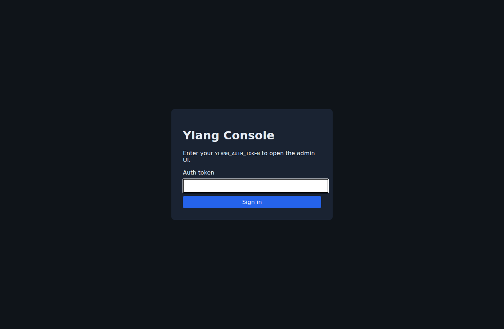

| Control | Behavior |
|---------|----------|
| Auth token | Same value as MCP / gateway Bearer token |
| Sign in | Sets `ylang_token` cookie and redirects |
| Logout | `POST /console/logout` from any page nav |

---

## Overview

**Route:** `GET /console`

Landing dashboard: system health, improver KPIs, optimization suggestions, and a live improver preview.

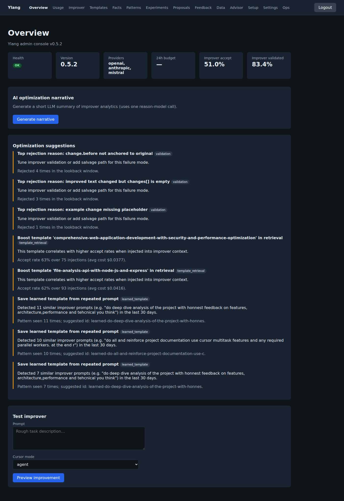

### What you see

| Section | Purpose |
|---------|---------|
| **Cards** | Health, version, configured providers, 24h budget, improver accept %, validated %, polish %, performance %, fact count |
| **Add facts** | When fact count is 0, CTA to suggest facts from usage (`/console/facts?suggest=1`) |
| **AI optimization narrative** | Optional one-shot LLM summary of improver analytics (shown when enough improver traffic exists) |
| **Optimization suggestions** | Propose-only ideas from funnel, validation, templates, and patterns (priority styling) |
| **Test improver** | Paste a rough prompt, pick Cursor mode, preview improved output without leaving the console |

### Related APIs

| Method | Path | Body |
|--------|------|------|
| `POST` | `/console/api/narrative` | Generate narrative (one reason-model call) |
| `POST` | `/console/api/suggest-facts` | Propose facts from improver usage (reason activity; no writes) |
| `POST` | `/console/api/improve-preview` | `{text, mode, tool?, model?}` |

---

## Control (Operator Hub)

**Route:** `GET /console/control`

Operational hub: 7-day health KPIs (accept, latency, polish/performance ratios, budget, cost), **Optimize Ylang** wizard, **top applyable proposals** with governed Apply, zero-accept template alerts, and quick links to Parameters, Data, and the improver sandbox on Overview.

| Panel | Content |
|-------|---------|
| **Optimize Ylang** (`#optimize-wizard`) | Four-step wizard: diagnose → propose → apply → measure (see below) |
| **Health KPIs** | 7d accept %, avg improver latency, **polish ratio**, **performance ratio**, 24h budget, 7d cost/requests/fired |
| **Quick links** | Parameters, Data, Improver sandbox (`/console#improver-sandbox`), Proposals, Usage |
| **Zero-accept alert** | Templates with 0% accept and ≥3 injections (7d) — links to Templates / Improver |
| **Top proposals** (`#top-proposals`) | Up to 6 pending applyable ops with **Apply** (same audit path as Proposals) |
| **At a glance** | Store counts, key effective config rows with default/override badges |

### Optimize Ylang wizard (`#optimize-wizard`)

Guided loop on Operator Hub (not a separate route):

1. **Diagnose** — Current 7d accept %, avg latency, and toxic template count (0% accept, ≥3 injections).
2. **Propose** — Jump to `#top-proposals` (optimizer + Control presets).
3. **Apply** — Governed **Apply** on a proposal (audited; runtime settings hot-reload; archives take effect immediately).
4. **Measure** — Check Improver / Usage; restart only for env-only settings.

**Polish ratio** — mean of `1 − edit_distance / len(original)` over `feedback_events` (`prompt_edit`) in the window. Shows `—` until the dual gate (console `edit_feedback` **and** hook capture) produces samples. Subtitle also shows **kept-as-is** rate (`edit_distance == 0`) and average edit distance.

**Near-zero polish ≠ broken.** A low polish score usually means the recent samples are harsh edits (large `edit_distance`) and/or there are few (or no) kept-as-is events yet. Collect more dual-gated feedback — especially prompts the user accepts without rewriting — before treating polish as a regression.

**Performance ratio** — `accept_rate × min(1, 8000ms / avg_latency_ms)`. High when accepts are strong **and** latency is at/under the 8s BL-010 target.

---

## Usage

**Route:** `GET /console/usage`

Rolling **7-day** usage dashboard (Chart.js, local static assets). Auto-refreshes every 30 seconds.

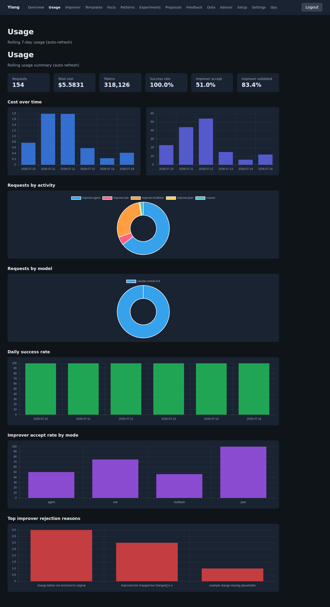

### Charts & metrics

- Requests, total cost, tokens, success rate
- Improver accept / validation rates
- Cost and requests over time
- Requests by activity and by model
- Daily success rate
- Improver accept rate by Cursor mode
- Top improver rejection reasons

Underlying data comes from the `usage` table (also browsable under **Data**).

---

## Improver

**Route:** `GET /console/improver`

Dedicated improver analytics for the last 7 days.

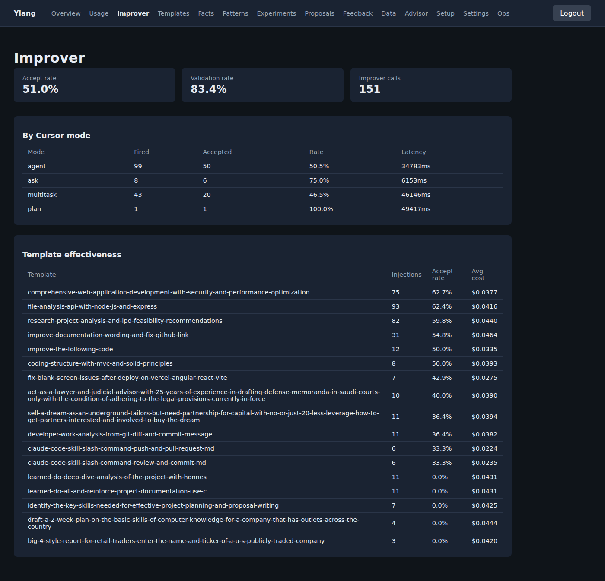

| Section | Contents |
|---------|----------|
| Summary cards | Accept rate, validation rate, **polish ratio**, **performance ratio**, total improver calls |
| By Cursor mode | Fired / accepted / rate / latency / **performance** per mode (`agent`, `plan`, …) |
| Template effectiveness | Top templates by accept rate when injected into improver context (injections, accept %, avg cost) |

Empty states: *No improver usage yet* / *No template injections yet*. When polish has no feedback samples, an empty-state CTA points to Parameters → `edit_feedback`.

Polish / performance formulas match Operator Hub (see above). Near-zero polish with a small sample of harsh edits is expected until kept-as-is feedback accumulates — not a console bug.

---

## Templates

**Route:** `GET /console/templates`

**Browse-first template studio**: search and paginate the library, edit (new version), AI-improve, preview render, delete (non-seed), and see lifetime improver **usage** (injection counts). Create is behind a **New template** disclosure so the browse table stays primary.

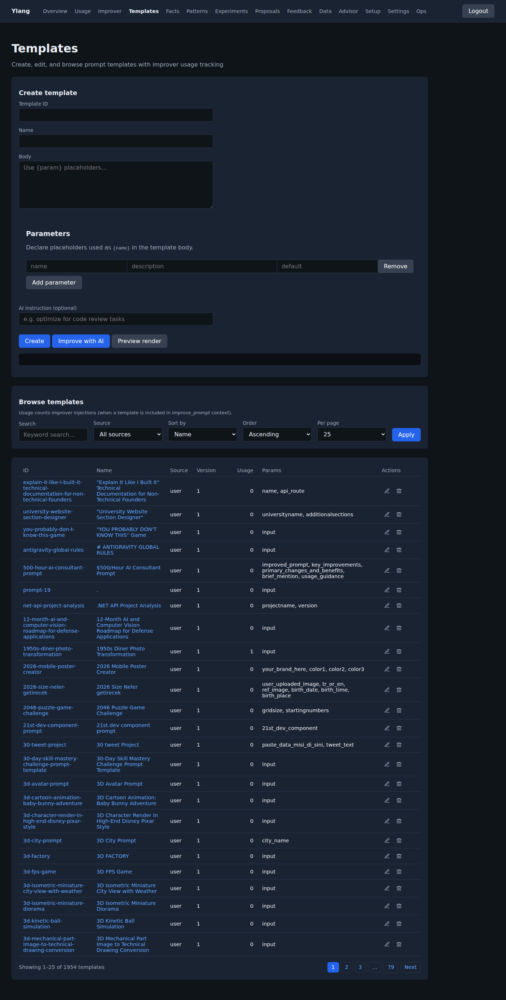

### Browse

| Query param | Description |
|-------------|-------------|
| `q` | Keyword search (FTS hybrid over id, name, body, tags) |
| `source` | `seed`, `user`, or `learned` |
| `visibility` | `public`, `private`, `archived`, `all`, or empty (= active non-archived) |
| `unused` | `1` / `true` — only templates with **usage = 0** (never injected by improver) |
| `toxic` | `1` / `true` — only **toxic** templates (0% accept with ≥3 injections; same set as retrieval hard-block) |
| `sort` | `name`, `id`, `source`, `version`, `usage`, `updated` |
| `order` | `asc` or `desc` |
| `page` | 1-based page |
| `per_page` | `10`, `25`, `50`, or `100` (default `25`) |
| `id` | Open edit panel (`#template-edit`) |

Table columns: ID, Name, Source, Visibility, Version, **Usage**, Params, Actions (edit / archive / delete).

**Usage** = lifetime improver injections (times the template was included in `improve_prompt` reference context). Same signal as Improver effectiveness, without the minimum-sample filter.

**Archive** sets `visibility=archived` (non-seed only). Archived templates are excluded from improver retrieval by default. **Unused only** + bulk archive removes noisy public imports that were never injected. Control Center can also propose archive of unused public templates via governed Apply.

**Toxic quarantine** — When any toxic templates exist, the browse panel shows **Quarantine toxic (0% accept)**. That button posts to `POST /console/templates/archive-toxic` and archives all eligible toxic templates (alias of bulk archive for the 0%-accept set). Filter with `?toxic=1` to review before quarantining.

Empty states: *No templates yet* (opens **New template**) / *No matching templates* (clear filters).

### New template

Collapsed by default (`#template-create`); open via the **New template** link above the table.

- Template ID (`[a-z0-9-]+`), name, body with `{param}` or `{{param}}` placeholders
- Parameter editor (name / description / default) plus **Detect from body** to fill rows from placeholders
- On save, placeholders in the body are merged into params automatically (even if Detect was skipped); existing form rows keep their description/default
- Optional AI instruction → **Improve with AI**
- **Preview render** shows editable preview values (defaults pre-filled), then the rendered body
- **Create** saves a new version (`source=user`)

### Edit / delete

- Click ID, name, or pencil → edit panel (save new version, AI improve, preview with editable param values, version history)
- Trash icon deletes non-`seed` templates (confirm dialog)
- Filters preserved via hidden `return_query` on save/delete

### APIs

| Method | Path | Purpose |
|--------|------|---------|
| `POST` | `/console/templates/save` | Create / new version |
| `POST` | `/console/templates/delete` | Delete non-seed |
| `POST` | `/console/templates/archive-toxic` | Quarantine (archive) all toxic 0%-accept templates |
| `POST` | `/console/api/improve-template` | `{name, body, params, instruction?}` |
| `POST` | `/console/api/render-template` | `{body, param_values}` |

---

## Facts

**Route:** `GET|POST /console/facts`

Local **memory** for preferences the improver injects into context (stack choices, style rules, conventions).

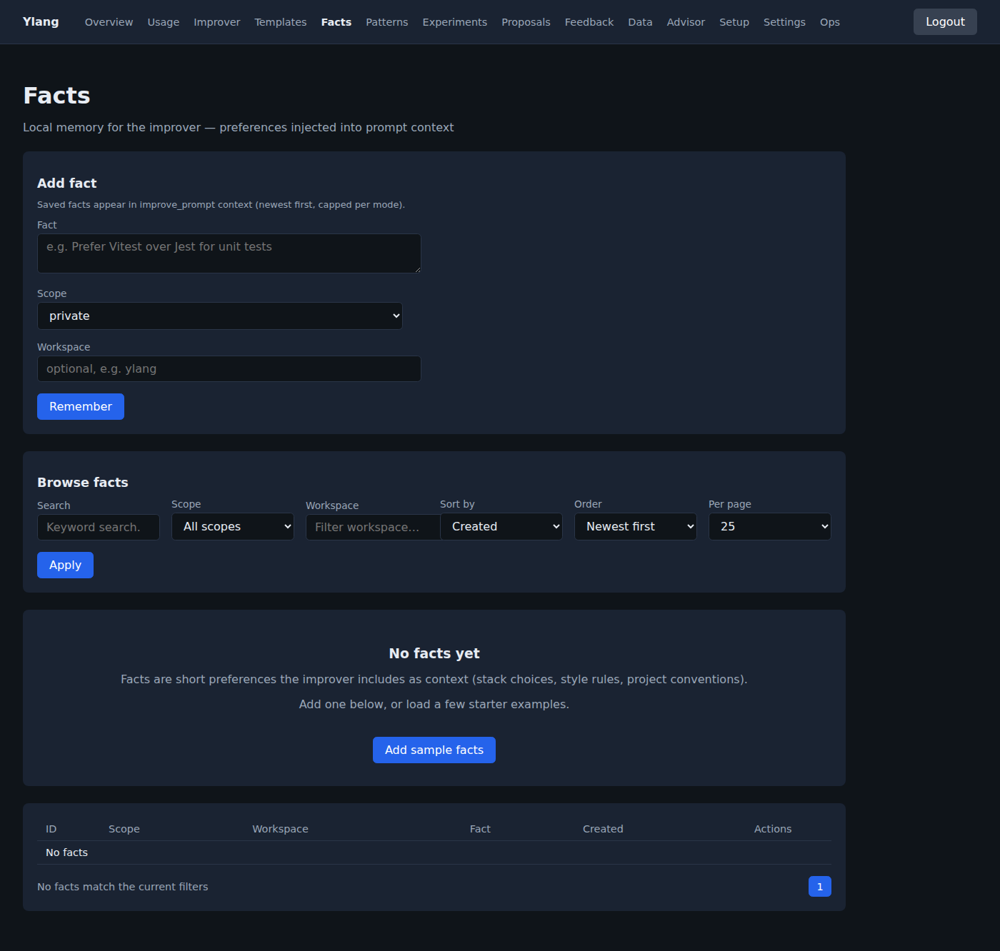

### Add

- Fact text, scope (`private` / `shareable`), optional workspace tag
- **Remember** → PRG redirect; opens edit panel for the new id

### Browse

| Query param | Description |
|-------------|-------------|
| `q` | Keyword over fact, workspace, scope, id |
| `scope` | `private` or `shareable` (invalid values ignored) |
| `workspace` | Substring filter |
| `sort` | `created`, `id`, `fact`, `scope`, `workspace` |
| `order` | default `desc` (newest first) |
| `page`, `per_page` | Same page sizes as Templates |
| `id` | Open edit panel (`#fact-edit`) |

### Empty store

When there are no facts, the page explains the feature and offers:

- **Suggest facts with AI** — `POST /console/api/suggest-facts` proposes candidates from recent improver usage / rejection patterns (reason-model call; propose-only). Review checkboxes, then **Save selected** via `POST /console/facts/accept-suggestions` (uses `memory.remember`). Overview links here with `?suggest=1` when fact count is 0.
- **Add sample facts** (`POST /console/facts/seed-samples`) — three starter preferences. Skipped if any facts already exist.

### Mutations

| Method | Path |
|--------|------|
| `POST` | `/console/facts` |
| `POST` | `/console/facts/update` |
| `POST` | `/console/facts/delete` |
| `POST` | `/console/facts/seed-samples` |
| `POST` | `/console/facts/accept-suggestions` |

Facts are also available via MCP `remember` / `recall_facts` and via Ops export/import.

---

## Patterns

**Route:** `GET /console/patterns`

Detect repeated improver prompts and propose **learned** templates.

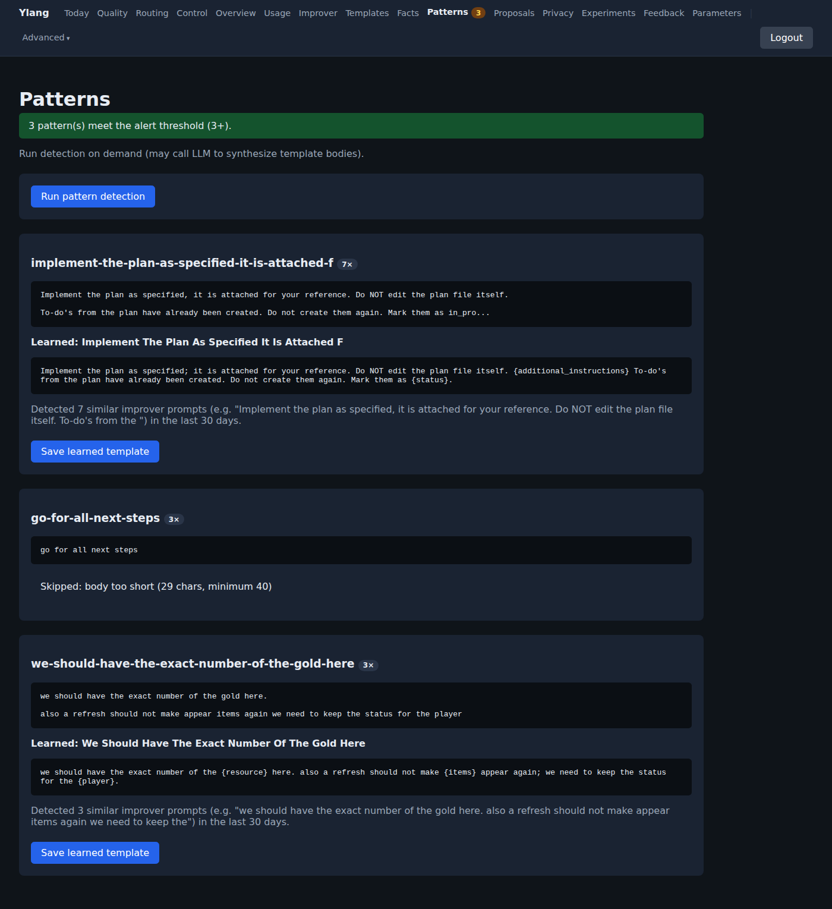

| Action | Behavior |
|--------|----------|
| **Run pattern detection** | Clusters recent improver inputs; may call the LLM to synthesize template bodies; results cached in runtime settings |
| Pattern cards | Pattern id, occurrence count, sample text |
| Proposal | Suggested template name/body/rationale |
| **Save learned template** | Persists as `source=learned` and redirects to Templates |

Nav badge appears when pattern count ≥ `pattern_alert_threshold` (Settings). Detector mode: `pattern_detector` = `lexical` or `semantic`.

| Method | Path |
|--------|------|
| `POST` | `/console/patterns/run` |
| `POST` | `/console/patterns/save` |

---

## Experiments

**Route:** `GET|POST /console/experiments`

A/B test **improver system-prompt** styles (`control` / `concise` / `verbose`) and review 7-day outcomes.

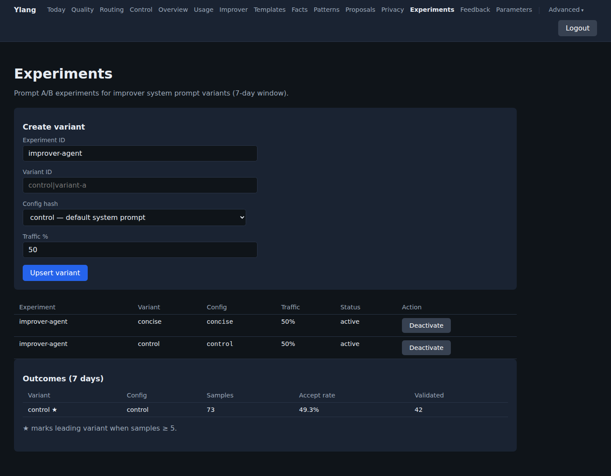

### Create variant

| Field | Meaning |
|-------|---------|
| Experiment ID | Grouping key (default `improver-agent`) |
| Variant ID | e.g. `control`, `variant-a` |
| Config hash | Which system-prompt style to use |
| Traffic % | Share of improver traffic (0–100) |

### Tables

- **Variants** — status + Activate / Deactivate
- **Outcomes (7 days)** — samples, accept rate, validated; ★ marks leader when samples ≥ 5

Enable runtime assignment with Settings → **experiments** (or `YLANG_EXPERIMENTS=1`). When the flag is off, the page is **not listed in nav** (deep link still works) and shows an empty-state CTA to enable it. When enabled with no variants, the empty state prompts you to create a control + alternate via **Upsert variant**.

| Method | Path |
|--------|------|
| `POST` | `/console/experiments` |
| `POST` | `/console/experiments/toggle` |

---

## Proposals

**Route:** `GET /console/proposals`

Review **propose-only** optimization suggestions and apply them explicitly (with audit log). Only suggestions with a concrete apply payload appear here (runtime setting key+value, save learned template id, or experiment winner).

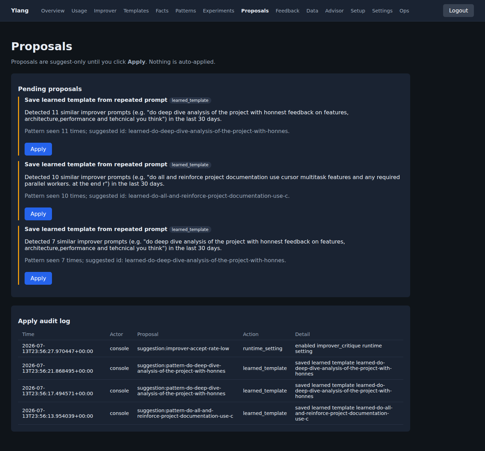

| Section | Purpose |
|---------|---------|
| Pending proposals | Title, kind badge, description, evidence, concrete apply summary, **Apply** |
| Apply audit log | Last apply actions (time, actor, proposal, detail) |

Already-applied proposal ids (and settings that already match the suggested value) are omitted from Pending — they remain in the audit log only. The optimizer / Control presets use the same filter, so re-running suggestions will not re-offer a setting that is already in effect.

Empty: *No applyable proposals in the last 7 days.* Apply is never automatic.

Proposal id forms:

| Prefix | Meaning |
|--------|---------|
| `suggestion:…` | Optimizer suggestion (setting or learned template) |
| `setting:key=value` | Direct runtime setting (e.g. Advisor recommendations) |
| `experiment:id:variant` | Promote experiment winner |

| Method | Path |
|--------|------|
| `POST` | `/console/proposals/apply` | `{proposal_id}` |

---

## Feedback

**Route:** `GET /console/feedback`

Inspect edit-feedback events when users change improver output before submit.

**Dual gate** (both required for captures → polish ratio):

1. Console runtime flag **`edit_feedback`** (Parameters) — gates Feedback nav and console surfaces.
2. Hook env **`YLANG_CAPTURE_EDIT_FEEDBACK=1`** — Cursor improve hook (`_should_capture_edit_feedback`) records edit distance via `record_prompt_edit`. Alias: **`YLANG_EDIT_FEEDBACK`**. `sessionStart` defaults capture to `1` when unset.

When `edit_feedback` is off, the page is **not listed in nav** (deep link still works) and shows an enable CTA; when on with no events yet, the empty state explains how captures appear from hook traffic (and reminds about `YLANG_CAPTURE_EDIT_FEEDBACK=1`).

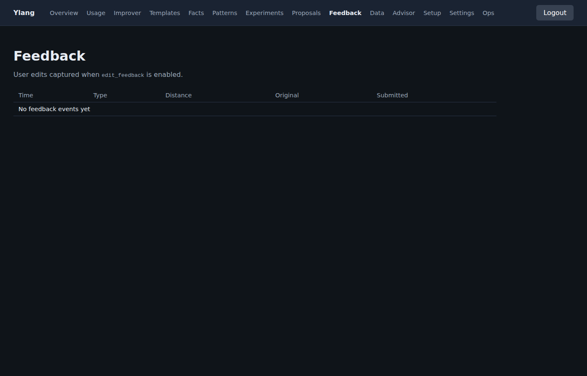

Table (recent events): time, type, edit distance, original snippet, submitted snippet.

---

## Data

**Route:** `GET /console/data`

Read-mostly SQLite browser with **domain view shortcuts** at the top, server-side row search, deep links, and safe mutators.

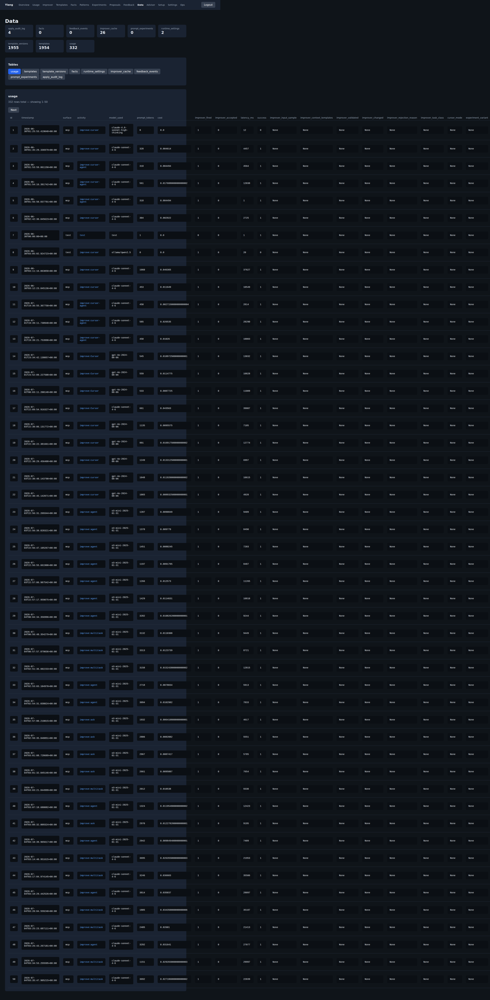

**Domain views** (top nav): Usage, Templates, Facts, Feedback, Cache, Audit — each deep-links to the matching table. **All tables** below lists every browsable SQLite table for raw browse.

| Query | Purpose |
|-------|---------|
| `table` | `usage`, `templates`, `template_versions`, `facts`, `runtime_settings`, `improver_cache`, `feedback_events`, `prompt_experiments`, `apply_audit_log`, … |
| `offset` | Pagination (50 rows/page) |
| `activity` | Filter `usage` by activity |
| `q` | `LIKE` filter across text columns (server-side) |

**Deep links:** `template_id` columns link to Templates search; fact `id` / `fact_id` link to Facts edit.

**Safe mutators** (POST + confirm, no raw SQL):

| Route | Action |
|-------|--------|
| `POST /console/data/clear-cache` | Clear in-memory + SQLite improver cache |
| `POST /console/data/delete-usage` | Delete one usage row by `id` |
| `POST /console/data/purge-usage` | Delete usage rows older than N days |

---

## Advisor

**Route:** `GET|POST /console/advisor`

Ask natural-language questions about improver performance, settings, and templates. Uses live analytics + one LLM call via `activity="reason"` (no hardcoded model; respects `models_reason` routing).

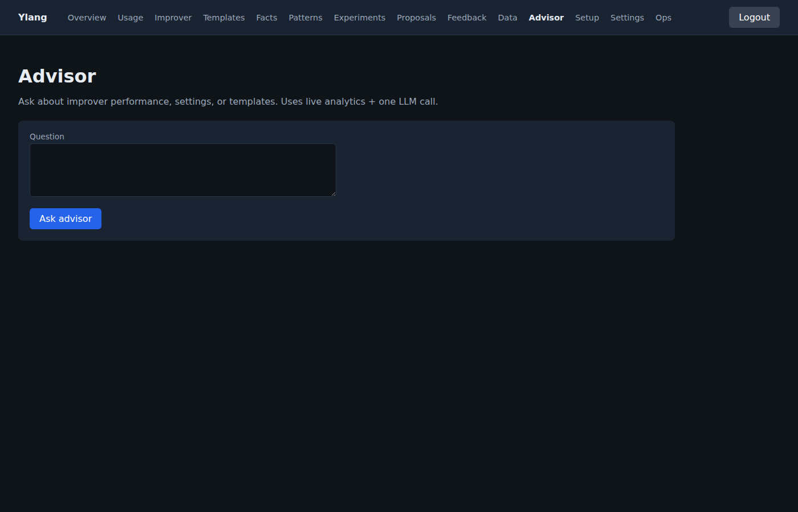

Enter a question → **Ask advisor** → reply panel. When the advisor recommends concrete setting changes, **Applyable setting changes** appear with **Apply** buttons that use the same governed `/console/proposals/apply` path (`setting:key=value`). Nothing is written until you click Apply.

---

## Setup

**Route:** `GET /console/setup`

Browser checklist equivalent to parts of `ylang init` / `ylang doctor`.

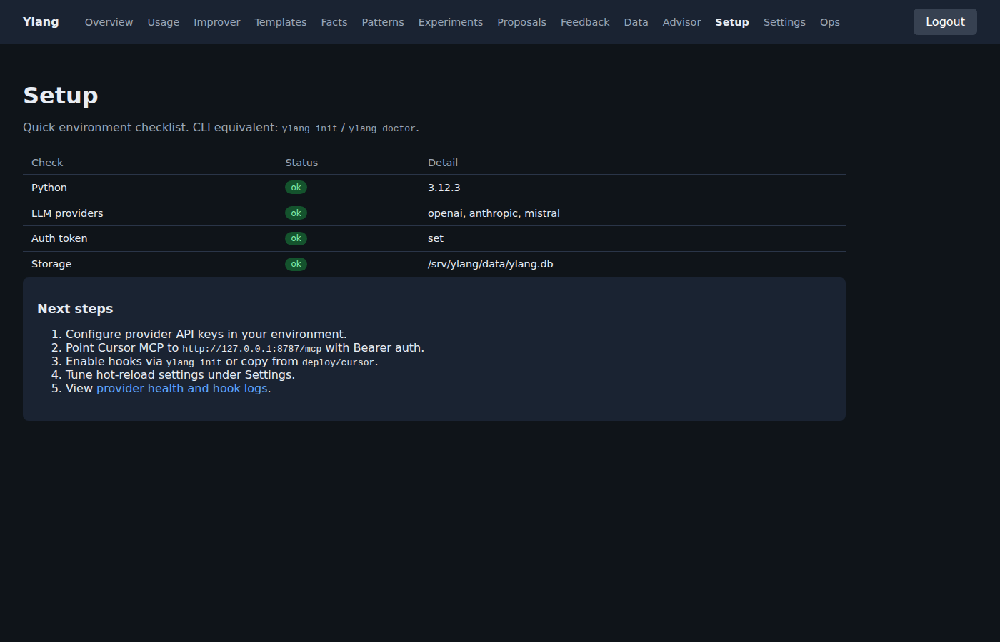

Checks: Python version, provider keys, auth token, storage path. Links onward to Settings and Health.

---

## Parameters

**Route:** `GET|POST /console/settings`

Hot-reload runtime overrides stored in SQLite `runtime_settings` (no process restart for these keys). Fields are grouped into:

| Section | Keys |
|---------|------|
| **Routing** | `models_*`, `quality_band`, `fallback_model` |
| **Improver** | `improver_timeout_sec`, `improver_critique`, `learned_template_limit`, `retrieval_preferred_template_ids` |
| **Limits** | `daily_budget_usd`, `provider_cooldown_seconds`, `rate_limit_per_minute`, `pattern_alert_threshold` |
| **Flags** | `experiments`, `edit_feedback`, `pattern_detector` (select), `usage_digest_enabled` (+ last-run stamp display) |

### Pending proposals embed

When applyable **runtime_setting** proposals exist (optimizer / experiments, last 7 days), Parameters shows a **Pending proposals** panel above the form. Each row uses governed **Apply** with `return_to=/console/settings` so you land back on Parameters after apply (same audit path as `/console/proposals`).

### Impact estimate

Under Presets, an **Impact estimate** subtitle always appears: `improver_timeout_sec ≤ 18` and `learned_template_limit ≤ 1` → “favors latency”; `models_improve` starting with Mistral → “fast path”; otherwise “quality-leaning …”.

### Preferred template picker

`retrieval_preferred_template_ids` includes a **checkbox chip picker** of candidate templates that syncs into the CSV field (in addition to free-text edit).

### Pattern detector

`pattern_detector` is a **select** (`lexical` | `semantic`), not a free-text field.

Restart-required env keys (secrets masked, bullet length capped) are listed read-only in a wrapping footer table so long keys do not overflow the panel.

Forms and action buttons show a page loading overlay (and button spinner) while a request is in flight.

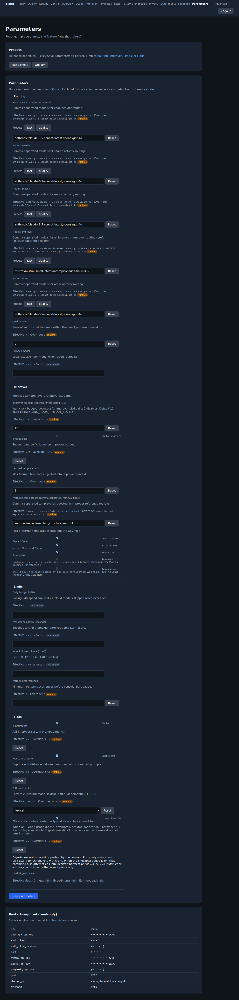

### Hot-reloadable keys

- `daily_budget_usd`, `quality_band`, `fallback_model`, `provider_cooldown_seconds`
- `pattern_detector`, `learned_template_limit`, `pattern_alert_threshold`
- `rate_limit_per_minute`, `improver_timeout_sec`
- `models_code`, `models_search`, `models_reason`, `models_improve`, `models_other`
- `improver_timeout_sec` — improver LLM wall-clock budget (seconds; default 12; `0` off)
- `retrieval_preferred_template_ids` — CSV of template ids preferred in retrieval (checkbox picker in UI)
- Feature flags: `improver_critique`, `experiments`, `edit_feedback`
- Digest: `usage_digest_enabled` (CLI/cron + optional `notify-send`), `usage_digest_last_at` (updated by `ylang usage digest`)

Digests are **not** emailed or pushed by the console. When `usage_digest_enabled` is on, `ylang usage digest` attempts a Linux desktop notification if `DISPLAY`/`WAYLAND_DISPLAY` and `notify-send` are available. Use `--notify` / `--no-notify` to override. See Ops page and [deployment.md](deployment.md) for cron examples.

Use **Reset** next to a field to clear that override back to env defaults.

**Presets:** **Fast / cheap** and **Quality** buttons fill improver-related fields (models, timeout, learned limit, critique); each field shows an **Effective** hint line with **env default** vs **runtime** override badges. Model list fields include **fast** / **quality** chips to fill comma-separated values without leaving the form.

---

## Ops

**Route:** `GET /console/ops`

Operational maintenance for the SQLite store.

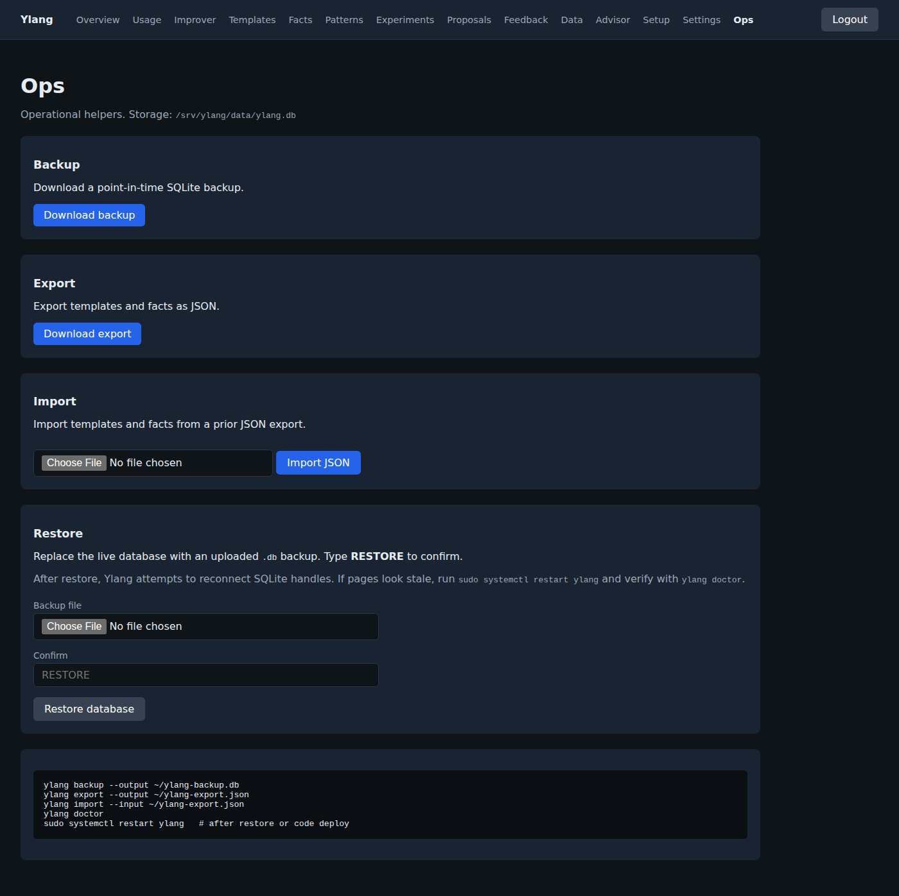

| Action | Endpoint | Notes |
|--------|----------|-------|
| Backup | `GET /console/ops/backup` | Download `.db` |
| Export | `GET /console/ops/export` | JSON (templates + facts) |
| Import | `POST /console/ops/import` | Upload prior JSON export |
| Restore | `POST /console/ops/restore` | Upload `.db` + type `RESTORE` |

CLI equivalents: `ylang backup`, `ylang export`, `ylang import`, `ylang doctor`.

### Usage digest (CLI/cron)

Ops includes a short digest reminder. Digests are not sent by the console:

```bash
ylang usage digest --last-days 7
ylang usage digest --last-days 7 --notify   # force desktop notify attempt
```

Schedule with cron (shared env + DB); see [deployment.md](deployment.md).

---

## Health

**Route:** `GET /console/health` (linked from Setup)

Provider reachability and Cursor hook log tail.

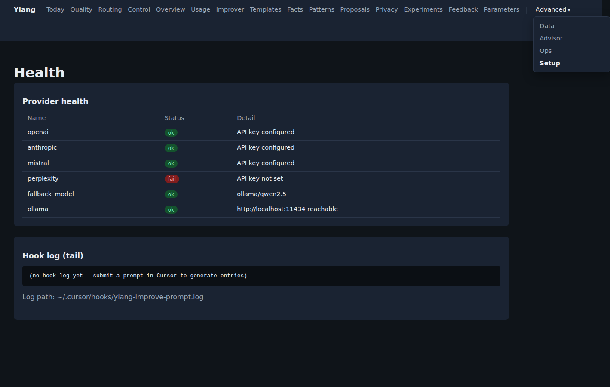

Use after deploy or when improver hooks appear stuck.

---

## Console JSON APIs

| Route | Description |
|-------|-------------|
| `POST /console/api/improve-template` | JSON `{name, body, params, instruction?}` — AI-improve template draft |
| `POST /console/api/render-template` | JSON `{body, param_values}` — preview template render |
| `POST /console/api/improve-preview` | JSON `{text, mode, tool, model}` — live improver preview |
| `POST /console/api/narrative` | Generate optimization narrative on demand (one LLM call) |
| `POST /console/api/suggest-facts` | Propose memory facts from improver usage (reason activity; no auto-write) |

Session cookie or `Authorization: Bearer` required (same as other console routes).

---

## Static assets

Chart.js is bundled at `/console/static/chart.umd.min.js` (offline-friendly).
Screen-specific CSS/JS extracted from page builders also live under `src/ylang/console/static/` and are served from `/console/static/*` with a one-day `Cache-Control` for `.js`/`.css`.

### Code layout

| Area | Location |
|------|----------|
| Route registration | `console/routes.py` → `console/route_modules/*` |
| Shared request context | `console/context.py` (`ConsoleContext`) |
| Page HTML | `console/pages.py` re-exports → `console/page_modules/*` |
| Full screens (login, data, …) | `console/pages_full.py` |
| Layout / nav chrome | `console/layout.py` |

---

## Feature flags (quick reference)

| Flag | Where set | Effect |
|------|-----------|--------|
| `improver_critique` | Settings / env | Extra critique pass in improver |
| `experiments` | Settings / `YLANG_EXPERIMENTS` | Assign A/B variants on improver calls |
| `edit_feedback` | Settings | Console nav / Feedback page gate (pair with hook `YLANG_CAPTURE_EDIT_FEEDBACK`) |
| `usage_digest_enabled` | Settings | When on, digest CLI may call `notify-send` |
| `pattern_alert_threshold` | Settings | Patterns nav badge threshold |
| `pattern_detector` | Settings | `lexical` vs `semantic` clustering |

---

## Setup wizard (CLI)

```bash
ylang init
```

Web equivalent: `/console/setup` plus `/console/health` for provider and hook checks.

See [installation.md](installation.md) and [configuration.md](configuration.md).
