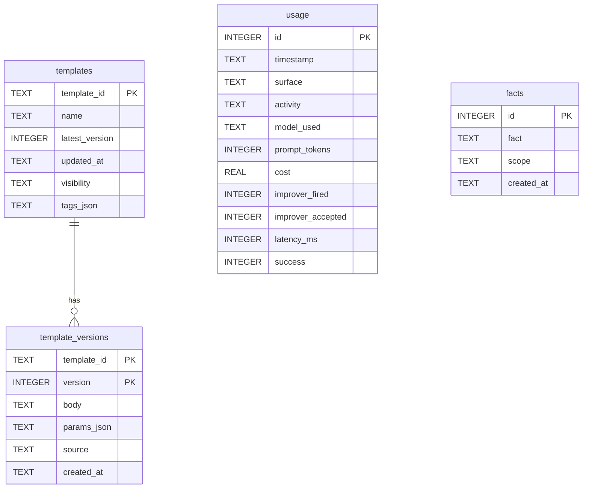

# Database schema

Ylang persists all data in a **single SQLite database** (default `~/.ylang/ylang.db`). Three stores share one connection via `open_stores()` in `src/ylang/core/stores.py`.

SQLite pragmas on open:

- `journal_mode=WAL`
- `busy_timeout=5000` (5 seconds)

## Entity relationship



## Table: usage

Written on **every** `Engine.complete()` call.

| Column | Type | Description |
|--------|------|-------------|
| `id` | INTEGER PK | Auto-increment row id |
| `timestamp` | TEXT | ISO 8601 UTC |
| `surface` | TEXT | Calling face (e.g. `mcp`) |
| `activity` | TEXT | Activity or `improve:<tool>` for improver |
| `model_used` | TEXT | LiteLLM model string that succeeded |
| `prompt_tokens` | INTEGER | Prompt token count |
| `cost` | REAL | Estimated USD cost from LiteLLM |
| `improver_fired` | INTEGER | 1 if improver initiated the call |
| `improver_accepted` | INTEGER | Reserved for future accept tracking |
| `latency_ms` | INTEGER | Wall-clock latency |
| `success` | INTEGER | 1 if completion succeeded |

Index: `idx_usage_timestamp` on `timestamp`.

## Table: templates

One row per logical template (latest version tracked here).

| Column | Type | Description |
|--------|------|-------------|
| `template_id` | TEXT PK | Stable slug |
| `name` | TEXT | Display name |
| `latest_version` | INTEGER | Highest version number |
| `updated_at` | TEXT | ISO 8601 UTC |
| `visibility` | TEXT | `public` or `private` |
| `tags_json` | TEXT | JSON array of tag strings |

## Table: template_versions

Append-only version history per template.

| Column | Type | Description |
|--------|------|-------------|
| `template_id` | TEXT PK (composite) | Foreign key to `templates` |
| `version` | INTEGER PK (composite) | Monotonic version number |
| `body` | TEXT | Template content |
| `params_json` | TEXT | JSON array of param objects |
| `source` | TEXT | `seed`, `user`, or `learned` |
| `created_at` | TEXT | ISO 8601 UTC |

Index: `idx_template_versions_source` on `source`.

### Param JSON shape

```json
[
  {"name": "language", "description": "Programming language", "default": "python"}
]
```

## Table: facts

User-remembered facts for improver context.

| Column | Type | Description |
|--------|------|-------------|
| `id` | INTEGER PK | Auto-increment |
| `fact` | TEXT | Fact content |
| `scope` | TEXT | `private` or `shareable` |
| `created_at` | TEXT | ISO 8601 UTC |

Index: `idx_facts_scope_created` on `(scope, created_at DESC)`.

## Schema initialization

Schemas are created idempotently on first store access:

- `UsageStore._ensure_schema()`
- `Library._ensure_schema()` + `ensure_seeds()` for built-in templates
- `MemoryStore._ensure_schema()`

No separate migration framework in Phase 1 — schema changes are applied via `CREATE TABLE IF NOT EXISTS` on startup.

## Files on disk

| File | Description |
|------|-------------|
| `ylang.db` | Main database |
| `ylang.db-wal` | WAL journal (when active) |
| `ylang.db-shm` | Shared memory for WAL |

Back up all three for a hot backup, or use `sqlite3 .backup` — see [deployment.md](deployment.md).

## Related docs

- [Architecture](architecture.md) — store wiring
- [MCP tools reference](mcp-tools.md) — CRUD operations on templates and facts
