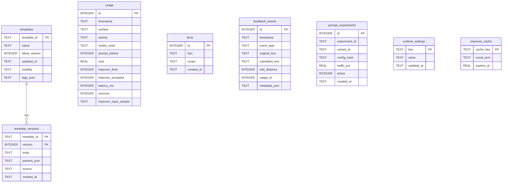

# Database schema

Ylang persists all data in a **single SQLite database** (default `~/.ylang/ylang.db`). Three stores share one connection via `open_stores()` in `src/ylang/core/stores.py`.

SQLite pragmas on open:

- `journal_mode=WAL`
- `busy_timeout=5000` (5 seconds)
- Connections use `check_same_thread=False` so async HTTP handlers can run queries in worker threads

## Entity relationship


```mermaid
erDiagram
    templates ||--o{ template_versions : has
    templates {
        TEXT template_id PK
        TEXT name
        INTEGER latest_version
        TEXT updated_at
        TEXT visibility
        TEXT tags_json
    }
    template_versions {
        TEXT template_id PK
        INTEGER version PK
        TEXT body
        TEXT params_json
        TEXT source
        TEXT created_at
    }
    usage {
        INTEGER id PK
        TEXT timestamp
        TEXT surface
        TEXT activity
        TEXT model_used
        INTEGER prompt_tokens
        REAL cost
        INTEGER improver_fired
        INTEGER improver_accepted
        INTEGER latency_ms
        INTEGER success
        TEXT improver_input_sample
    }
    facts {
        INTEGER id PK
        TEXT fact
        TEXT scope
        TEXT created_at
    }
    feedback_events {
        INTEGER id PK
        TEXT timestamp
        TEXT event_type
        TEXT original_text
        TEXT submitted_text
        INTEGER edit_distance
        INTEGER usage_id
        TEXT metadata_json
    }
    prompt_experiments {
        INTEGER id PK
        TEXT experiment_id
        TEXT variant_id
        TEXT config_hash
        REAL traffic_pct
        INTEGER active
        TEXT created_at
    }

    runtime_settings {
        TEXT key PK
        TEXT value
        TEXT updated_at
    }
    improver_cache {
        TEXT cache_key PK
        TEXT result_json
        REAL expires_at
    }
```

## Table: usage

Written on every `Engine.complete()` or `Engine.complete_stream()` call, except when improver wall-clock timeout cancels a late `complete` usage write (the timeout path records a `success=0` stub with `improver_rejection_reason='improver timeout'` instead; any slipped late success rows are marked `improver timeout orphan` and excluded from improver funnel metrics).

| Column | Type | Description |
|--------|------|-------------|
| `id` | INTEGER PK | Auto-increment row id |
| `timestamp` | TEXT | ISO 8601 UTC |
| `surface` | TEXT | Calling face: `mcp` or `gateway` |
| `activity` | TEXT | Routing bucket (e.g. `code`, `reason`) or `improve:<cursor_mode>` for improver |
| `model_used` | TEXT | LiteLLM model string that succeeded |
| `prompt_tokens` | INTEGER | Prompt token count |
| `cost` | REAL | Estimated USD cost from LiteLLM |
| `improver_fired` | INTEGER | 1 if improver initiated the call |
| `improver_accepted` | INTEGER | 1 when improver suggestion was accepted |
| `improver_input_sample` | TEXT | Truncated original prompt when improver fired (~200 chars) |
| `improver_context_templates` | TEXT | Comma-separated template ids injected into improver context |
| `improver_validated` | INTEGER | 1 when improver output passed validation |
| `improver_changed` | INTEGER | 1 when improved text differs from input |
| `improver_rejection_reason` | TEXT | Validation rejection reason, if any |
| `improver_task_class` | TEXT | Detected task class: `structural`, `analysis`, `implementation` |
| `cursor_mode` | TEXT | Resolved Cursor mode for improver calls |
| `experiment_variant` | TEXT | A/B experiment variant id when `YLANG_EXPERIMENTS=1` |
| `latency_ms` | INTEGER | Wall-clock latency |
| `success` | INTEGER | 1 if completion succeeded |

Index: `idx_usage_timestamp` on `timestamp`.

### Activity normalization

At insert time, `usage/store.py` calls `normalize_usage_activity()` (`usage/activity.py`):

- Non-improver activities are lowercased (e.g. `code`, `gateway`).
- `improve:*` suffixes map to canonical Cursor modes: `improve:Cursor` and `improve:cursor-agent` → `improve:agent`; unknown suffixes (e.g. legacy tool slugs) are lowercased only.

The improver logs `improve:{cursor_mode}` (e.g. `improve:agent`, `improve:plan`), not the MCP `tool` name.

## Table: templates

One row per logical template (latest version tracked here).

| Column | Type | Description |
|--------|------|-------------|
| `template_id` | TEXT PK | Stable slug |
| `name` | TEXT | Display name |
| `latest_version` | INTEGER | Highest version number |
| `updated_at` | TEXT | ISO 8601 UTC |
| `visibility` | TEXT | `public`, `private`, or `archived` (archived templates are excluded from improver retrieval by default) |
| `tags_json` | TEXT | JSON array of tag strings |

## Table: template_versions

Append-only version history per template.

| Column | Type | Description |
|--------|------|-------------|
| `template_id` | TEXT PK (composite) | Foreign key to `templates` |
| `version` | INTEGER PK (composite) | Monotonic version number |
| `body` | TEXT | Template content |
| `params_json` | TEXT | JSON array of param objects |
| `source` | TEXT | `seed`, `user`, or `learned` |
| `created_at` | TEXT | ISO 8601 UTC |

Index: `idx_template_versions_source` on `source`.

### Param JSON shape

```json
[
  {"name": "language", "description": "Programming language", "default": "python"}
]
```

## Table: facts

User-remembered facts for improver context.

| Column | Type | Description |
|--------|------|-------------|
| `id` | INTEGER PK | Auto-increment |
| `fact` | TEXT | Fact content |
| `scope` | TEXT | `private` or `shareable` |
| `created_at` | TEXT | ISO 8601 UTC |

Index: `idx_facts_scope_created` on `(scope, created_at DESC)`.

## Table: runtime_settings

Hot-reloadable configuration overrides editable from the admin console without restart.

| Column | Type | Description |
|--------|------|-------------|
| `key` | TEXT PK | Setting name (see [configuration.md](configuration.md#runtime-settings-console)) |
| `value` | TEXT | Serialized override value |
| `updated_at` | TEXT | ISO 8601 UTC |

## Table: improver_cache

Short-lived cache for `improve_prompt` results (60s TTL). Avoids duplicate LLM calls when the same prompt is submitted repeatedly.

| Column | Type | Description |
|--------|------|-------------|
| `cache_key` | TEXT PK | Hash of improver inputs |
| `result_json` | TEXT | Serialized `ImprovementResult` JSON |
| `expires_at` | REAL | Unix timestamp when the row expires |

Expired rows are deleted on read. Tests may call `clear_improver_cache_store()` to reset the table.

## Schema initialization

Base tables are created idempotently on first store access:

- `UsageStore._ensure_schema()`
- `Library._ensure_schema()` + `ensure_seeds()` for built-in templates
- `MemoryStore._ensure_schema()`

Incremental changes use a versioned migration runner in `src/ylang/core/migrations.py`
(`schema_migrations` table). On open, `run_migrations()` applies any pending versions
(facts workspace, improver columns, FTS, feedback, experiments, runtime settings,
improver cache, apply audit log, and related indexes). New installs still get
`CREATE TABLE IF NOT EXISTS` from stores; upgrades rely on numbered migrations.

## Files on disk

| File | Description |
|------|-------------|
| `ylang.db` | Main database |
| `ylang.db-wal` | WAL journal (when active) |
| `ylang.db-shm` | Shared memory for WAL |

Back up all three for a hot backup, or use `sqlite3 .backup` — see [deployment.md](deployment.md).

## Related docs

- [Architecture](architecture.md) — store wiring
- [MCP tools reference](mcp-tools.md) — CRUD operations on templates and facts
