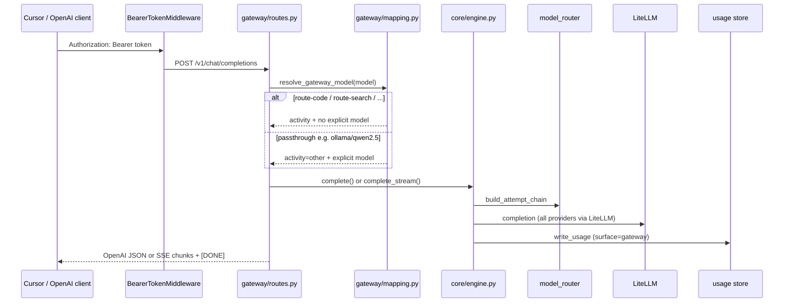

# OpenAI-compatible gateway

Ylang exposes an **OpenAI-compatible HTTP gateway** on the same host, port, and bearer auth as the MCP HTTP transport. Point Cursor (or any OpenAI-compatible client) at it to route real coding traffic through Ylang's activity-based model selection.

The gateway is enabled automatically when `YLANG_TRANSPORT=http`. Startup stderr logs the route paths and virtual model names. **Stdio transport has no `/v1/*` routes** — use HTTP for the gateway.

## Availability

| Transport | MCP | Gateway (`/v1/*`) |
|-----------|-----|-------------------|
| `stdio` (default) | Yes | No |
| `http` | Yes (`/mcp`) | Yes (requires `YLANG_AUTH_TOKEN`) |

## Endpoints

| Method | Path | Description |
|--------|------|-------------|
| `POST` | `/v1/chat/completions` | Chat completions (streaming and non-streaming) |
| `GET` | `/v1/models` | Virtual route model catalog |

Both routes share the same HTTP server as MCP (`/mcp`). There is no separate gateway port or process.

## Authorization

HTTP transport requires a bearer token on **every** HTTP request (MCP and gateway):

| Item | Value |
|------|-------|
| Header | `Authorization: Bearer <YLANG_AUTH_TOKEN>` |
| Env var | `YLANG_AUTH_TOKEN` (required when `YLANG_TRANSPORT=http`) |
| Missing / wrong token | **401 Unauthorized** (plain text body) |
| stdio transport | No auth — Cursor spawns a local subprocess |

The middleware compares the full `Authorization` header value with constant-time `secrets.compare_digest`. Send exactly `Bearer <token>` with no extra whitespace.

## GET /v1/models

Returns the four virtual route models. Passthrough provider slugs are **not** listed here — clients may still send them in `POST /v1/chat/completions`.

**Sample response:**

```json
{
  "object": "list",
  "data": [
    {"id": "route-code", "object": "model", "created": 1710000000, "owned_by": "ylang"},
    {"id": "route-search", "object": "model", "created": 1710000000, "owned_by": "ylang"},
    {"id": "route-reason", "object": "model", "created": 1710000000, "owned_by": "ylang"},
    {"id": "route-other", "object": "model", "created": 1710000000, "owned_by": "ylang"}
  ]
}
```

## POST /v1/chat/completions

### Request

Required JSON fields:

| Field | Type | Notes |
|-------|------|-------|
| `model` | string | Virtual `route-*` id or passthrough model slug |
| `messages` | array | At least one message; each has `role` (`system`, `user`, or `assistant`) and `content` |
| `stream` | boolean | Optional; default `false`. Set `true` for SSE streaming |

`content` may be a string or an array of `{type: "text", text: "..."}` parts (text parts are joined with newlines).

**Sample non-streaming request:**

```json
{
  "model": "route-code",
  "messages": [{"role": "user", "content": "write hello world in python"}]
}
```

### Non-streaming response

On success (**200**), the body matches OpenAI `chat.completion` shape:

```json
{
  "id": "chatcmpl-abc123...",
  "object": "chat.completion",
  "created": 1710000000,
  "model": "route-code",
  "choices": [
    {
      "index": 0,
      "message": {"role": "assistant", "content": "..."},
      "finish_reason": "stop"
    }
  ],
  "usage": {
    "prompt_tokens": 12,
    "completion_tokens": 34,
    "total_tokens": 46
  }
}
```

The `model` field echoes the **client request model** (e.g. `route-code`), not the LiteLLM model that actually served the call.

Errors use OpenAI-style `{ "error": { "message", "type", "param?", "code?" } }` JSON. Common cases:

| Status | When |
|--------|------|
| 400 | Invalid JSON, missing `model`/`messages`, bad message shape |
| 401 | Missing or wrong bearer token |
| 404 | All models in the attempt chain failed (`code: model_not_found`) |
| 500 | Unexpected server error |

### Streaming

Set `"stream": true`. The response is `text/event-stream` with OpenAI-style SSE chunks:

```text
data: {"id":"chatcmpl-...","object":"chat.completion.chunk","choices":[{"index":0,"delta":{"role":"assistant"},"finish_reason":null}]}

data: {"id":"chatcmpl-...","object":"chat.completion.chunk","choices":[{"index":0,"delta":{"content":"hello"},"finish_reason":null}]}

data: {"id":"chatcmpl-...","object":"chat.completion.chunk","choices":[{"index":0,"delta":{},"finish_reason":"stop"}]}

data: [DONE]
```

If the model chain fails before any content is emitted, the handler returns **404** JSON instead of an SSE stream. Partial stream failures after content has started terminate with a final chunk and `[DONE]`.

## Virtual route models

| Model id | Engine activity | Routing |
|----------|-----------------|---------|
| `route-code` | `code` | Quality-first list for coding tasks |
| `route-search` | `search` | Search-oriented models |
| `route-reason` | `reason` | Reasoning / planning models |
| `route-other` | `other` | General fallback bucket |

Each virtual model triggers **activity routing**: the Engine picks the best available model from the configured list for that activity (see [configuration.md](configuration.md)), then walks the fallback chain on failure.

Gateway traffic does **not** run the improver (`improver_fired=False`).

## Passthrough model names

Any `model` string that is **not** a virtual `route-*` id is treated as an explicit passthrough:

1. The gateway maps it to `activity=other` and passes the raw string to the Engine as `explicit_model`.
2. `ModelRouter.resolve_explicit_model()` translates it to LiteLLM form when possible:
   - Already LiteLLM-routable: `provider/model` (e.g. `openai/gpt-4o`, `anthropic/claude-3-5-sonnet-latest`, `mistral/mistral-large-latest`, `ollama/qwen2.5`)
   - Cursor slug aliases (e.g. `gpt-4o`, `claude-sonnet-4-6`, `composer-2.5-fast`) → mapped provider/model
   - Prefix rules: `claude-sonnet-4-*` → `anthropic/claude-sonnet-4-6`, `claude-opus-4-*` → `anthropic/claude-opus-4-6`
   - Unrecognized slugs: warning logged; activity routing proceeds without the explicit model
3. The attempt chain tries the resolved explicit model first, then the activity-selected model, then remaining candidates, then the fallback floor (`ollama/qwen2.5` by default).

Provider translation lives in core — the gateway has no provider-specific code.

## Request flow



## Cursor setup

1. Deploy Ylang on HTTP transport ([deployment.md](deployment.md)).
2. In Cursor → **Settings → Models**, add a custom OpenAI-compatible provider:
   - **Base URL:** `http://<host>:8787/v1` (e.g. `http://stelsrv-d001:8787/v1`)
   - **API key:** your `YLANG_AUTH_TOKEN`
3. Select **`route-code`** as the model for Agent/chat traffic you want routed through Ylang.

**Notes:**

- **Endpoint verification:** Cursor may verify custom endpoints **server-side**. A LAN hostname can fail verification even when the endpoint works from your machine. Try the host IP address if verification fails.
- Tab/autocomplete typically stays on Cursor's built-in models; the gateway captures chat/agent requests you explicitly route.
- MCP (`/mcp`) and the gateway (`/v1/*`) share auth and the same process.

See also [cursor-integration.md](cursor-integration.md) for MCP and hook setup (complementary to gateway routing).

## Examples

### Auth check (expect 401)

```bash
curl -s -o /dev/null -w "%{http_code}\n" \
  -X POST http://127.0.0.1:8787/v1/chat/completions -d '{}'
```

### Virtual model list

```bash
curl -s http://127.0.0.1:8787/v1/models \
  -H "Authorization: Bearer YOUR_TOKEN"
```

### Routed completion

```bash
curl -s http://127.0.0.1:8787/v1/chat/completions \
  -H "Authorization: Bearer YOUR_TOKEN" \
  -H "Content-Type: application/json" \
  -d '{"model":"route-code","messages":[{"role":"user","content":"write hello world in python"}]}'
```

### Passthrough completion

```bash
curl -s http://127.0.0.1:8787/v1/chat/completions \
  -H "Authorization: Bearer YOUR_TOKEN" \
  -H "Content-Type: application/json" \
  -d '{"model":"ollama/qwen2.5","messages":[{"role":"user","content":"hi"}]}'
```

### Streaming

```bash
curl -N http://127.0.0.1:8787/v1/chat/completions \
  -H "Authorization: Bearer YOUR_TOKEN" \
  -H "Content-Type: application/json" \
  -d '{"model":"route-code","stream":true,"messages":[{"role":"user","content":"hi"}]}'
```

After a successful request, `usage_summary` should show a row with `surface=gateway` and the matching activity (e.g. `code` for `route-code`).

### Usage dashboard

When `YLANG_TRANSPORT=http`, open `GET /usage` (same bearer auth as gateway routes) for a Chart.js dashboard of the last 7 days: cost over time, requests by activity and model, daily success rate. The page auto-refreshes every 30 seconds.

Alternatively, generate a standalone file:

```bash
ylang usage dashboard --output /tmp/ylang-usage.html --last-days 7
```

## OpenAI parity limits

The gateway implements enough of the OpenAI chat API for Cursor routing. Known gaps:

| Field | Behavior |
|-------|----------|
| `usage.completion_tokens` | From LiteLLM usage metadata (non-streaming) |
| `usage.total_tokens` | `prompt_tokens + completion_tokens` (non-streaming and streaming final chunk) |
| Streaming token counts | Emitted in final SSE chunk when LiteLLM includes usage (`stream_options.include_usage`) |
| `tools` / `tool_choice` | Forwarded to LiteLLM on streaming and non-streaming requests |
| Streaming tool calls | `tool_calls` deltas emitted in SSE chunks; finish reason `tool_calls` |
| `/v1/models` catalog | Lists virtual `route-*` models only; passthrough slugs are accepted but not advertised |

## Related docs

- [Architecture](architecture.md) — one core, multiple faces
- [Configuration](configuration.md) — model lists per activity
- [Deployment](deployment.md) — HTTP transport and systemd
- [Cursor integration](cursor-integration.md) — MCP and hooks
