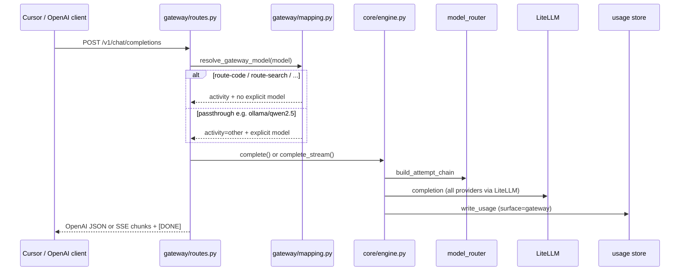

# OpenAI-compatible gateway

Ylang exposes an **OpenAI-compatible HTTP gateway** on the same host, port, and bearer auth as the MCP HTTP transport. Point Cursor (or any OpenAI-compatible client) at it to route real coding traffic through Ylang's activity-based model selection.

## Endpoints

| Method | Path | Description |
|--------|------|-------------|
| `POST` | `/v1/chat/completions` | Chat completions (streaming and non-streaming) |
| `GET` | `/v1/models` | Virtual route models and passthrough catalog |

Auth: `Authorization: Bearer <YLANG_AUTH_TOKEN>` — same token as MCP HTTP. Requests without a valid token receive **401**.

The gateway is enabled automatically when `YLANG_TRANSPORT=http`. Startup stderr logs the route and virtual model names.

## Virtual route models

| Model id | Engine activity | Routing |
|----------|-----------------|---------|
| `route-code` | `code` | Quality-first list for coding tasks |
| `route-search` | `search` | Search-oriented models |
| `route-reason` | `reason` | Reasoning / planning models |
| `route-other` | `other` | General fallback bucket |

Any other `model` string is treated as an **explicit passthrough** to LiteLLM via the Engine (e.g. `ollama/qwen2.5`, `gpt-4o`, `claude-sonnet-4-6`, `mistral/mistral-large`). Provider translation stays in core — the gateway has no provider-specific code.

## Request flow



Gateway traffic does **not** run the improver (`improver_fired=False`).

## Cursor setup

1. Deploy Ylang on HTTP transport ([deployment.md](deployment.md)).
2. In Cursor → **Settings → Models**, add a custom OpenAI-compatible provider:
   - **Base URL:** `http://<host>:8787/v1` (e.g. `http://stelsrv-d001:8787/v1`)
   - **API key:** your `YLANG_AUTH_TOKEN`
3. Select **`route-code`** as the model for Agent/chat traffic you want routed through Ylang.

**Notes:**

- Cursor may verify custom endpoints server-side; a LAN hostname can fail verification even when the endpoint works. Try the host IP if needed.
- Tab/autocomplete typically stays on Cursor's built-in models; the gateway captures chat/agent requests you explicitly route.
- MCP (`/mcp`) and the gateway (`/v1/*`) share auth and the same process.

## Examples

### Auth check (expect 401)

```bash
curl -s -o /dev/null -w "%{http_code}\n" \
  -X POST http://127.0.0.1:8787/v1/chat/completions -d '{}'
```

### Routed completion

```bash
curl -s http://127.0.0.1:8787/v1/chat/completions \
  -H "Authorization: Bearer YOUR_TOKEN" \
  -H "Content-Type: application/json" \
  -d '{"model":"route-code","messages":[{"role":"user","content":"write hello world in python"}]}'
```

### Streaming

```bash
curl -N http://127.0.0.1:8787/v1/chat/completions \
  -H "Authorization: Bearer YOUR_TOKEN" \
  -H "Content-Type: application/json" \
  -d '{"model":"route-code","stream":true,"messages":[{"role":"user","content":"hi"}]}'
```

### Virtual model list

```bash
curl -s http://127.0.0.1:8787/v1/models \
  -H "Authorization: Bearer YOUR_TOKEN"
```

After a successful request, `usage_summary` should show a row with `surface=gateway` and `activity=code` (for `route-code`).

## Related docs

- [Architecture](architecture.md) — one core, multiple faces
- [Configuration](configuration.md) — model lists per activity
- [Deployment](deployment.md) — HTTP transport and systemd
- [Cursor integration](cursor-integration.md) — MCP and hooks (complementary to gateway routing)
